---
jupytext:
  cell_metadata_filter: all,-hidden,-heading_collapsed
  notebook_metadata_filter: all,-language_info,-toc,-jupytext.text_representation.jupytext_version,-jupytext.text_representation.format_version
  text_representation:
    extension: .md
    format_name: myst
kernelspec:
  display_name: Calysto Bash
  language: bash
  name: calysto_bash
nbhosting:
  title: les bases
---

<div class="licence">
<span>Licence CC BY-NC-ND</span>
<div style="display:grid">
    <span>Thierry Parmentelat</span>
    <span>Valérie Roy</span>
</div>
</div>


+++

# `git` en local : les bases

+++

Une introduction didactique sur une première utilisation du logiciel de gestion de versions `git`.

+++

## on contextualise

+++

Vous avez l'intention de réaliser un projet logiciel. Celui-ci va se constituer petit à petit de tout un tas de fichiers (code, documentation, readme...) qui vont participer ensemble à ce projet logiciel.

Le projet va être initié, à un instant, puis il va évoluer dans le temps au fur et à mesure de l'écriture du code et la documentation, voire d'autres choses comme les jeux de tests...

+++

### les problèmes classiques des programmeurs

+++

Depuis que le code existe les programmeurs ont plusieurs problèmes, parmi les plus répandus:

- **ne pas *perdre* les fichiers** *localement* en les écrasant ou en les détruisant involontairement (oui, on a tous fait cela au moins une fois...)

- **pouvoir *revenir* en arrière** dans des versions précédentes de vos fichiers;
  Par exemple les évolutions que vous avez commencées sont cassées, c'était une mauvaise idée. Ou encore un de vos *clients* utilise une ancienne version du logiciel dont il est tellement content (la version est bien *stable*, les fonctionnalités lui suffisent) qu'il ne veut pas passer à la nouvelle version de votre logiciel ... mais il voudrait quand même, sur *sa* version, une petite modification. Le client est toujours exigeant. C'est d'ailleurs au moment où vous avez des utilisateurs que les ennuis commencent (mais heu non, on ne peut pas se passer des utilisateurs).

- **travailler en équipe** (oui c'est parfois aussi un problème pour les développeurs...)

- permettre à tout le monde d'utiliser leurs programmes, ou d'y apporter leur contribution, même **à des gens qu'on ne connait pas** a priori

- héberger un projet à l'extérieur de son ordinateur (sur serveur distant, sur Internet, sur le réseau local...)

+++

### quand les programmeurs travaillent en équipe

+++

Les programmeurs sont très souvent amenés à travailler en équipe sur un même projet. Il y
a là plusieurs possibilités:

 1. les rôles sont bien séparés. Les personnes travaillent sur des fichiers complètement différents. Par exemple, l'un fait le code et l'autre fait la documentation. Rien de compliqué là pour gérer l'évolution de votre projet: les fichiers sont parfaitement séparés.


 2. les rôles sont moins bien séparés. Les personnes sont amenées à intervenir dans le même fichier à des endroits bien séparés. C'est un peu plus compliqué, mais ca reste possible; en effet, les modifications peuvent être fusionnées *automatiquement* dans un nouveau fichier, sans intervention de personne.


 3. vous vous en doutez: les personnes ont travaillé dans le même fichier aux mêmes endroits et leurs modifications se chevauchent (c'est fréquent voire habituel, ce n'est pas du tout un cas isolé provenant d'une configuration de travail dégénérée). Il n'est naturellement plus possible de construire automatiquement un fichier contenant le travail de ces personnes sans une intervention *humaine*. Nous ressentons alors le besoin de lister les différences entre les fichiers.

Notons, qu'il peut vous arriver aussi, *même en travaillant seul*, de travailler *en même temps* sur plusieurs souches  de votre code (on parlera alors de branches). Par exemple, vous avez cloisonné dans différentes branches de votre code la programmation de fonctionnalités très différentes. Pour *réconcilier* ensuite toutes ces branches, vous avez besoin vous aussi d'outils de *fusion automatique* des modifications (et donc avec la même réserve, lorsque deux branches ont eu un impact sur la même zone de code).

+++

### besoin de l'outil de gestion de versions `git`

+++

Vous avez compris, quel que soit le niveau de ce que vous faites dans votre projet logiciel, vous n'allez **pas gérer à-la-main** toutes ces choses. Quand vous êtes seul sur votre code ca va déjà être compliqué, mais à plusieurs c'est une hérésie (on pèse les mots): vous n'allez quand même pas vous envoyer vos modifications par e_mails ! Vous le faites ? Et bien raison de plus pour bien suivre ce cours...

+++

Cela fait très très longtemps que les programmeurs utilisent des systèmes de gestion de version de logiciel et les manières de faire ont beaucoup évolué, et parfois ont changé radicalement (*sccs* en 1970, rcs vers 1980, cvs vers 1990, subversion vers 2004 et git en 2007)

Actuellement **le** système qui s'impose c'est `git`; oui, encore un *coup* du super bon et tout autant irascible Linus Torvalds (le gars qui a commis Linux).

Et c'est de `git` que nous allons vous parler ici.

+++

`git` va nous permettre de *consigner* les modifications apportées à un fichier ou à un ensemble de fichiers au cours du temps, et ceci de manière à :

- conserver toutes les traces du développement d'un projet,
- ajouter à la notion de *fichier/contenu*, les dimensions de "*temps*" et de "*qui a fait quoi, comment et pourquoi*".

Au lieu de ne considérer que l'état d'un répertoire à un moment donné, on va aussi en conserver des copies au cours du temps, et organiser ces différents états dans un *graphe de dépendance annoté* (date, commentaire, etc...) que nous pourrons visualiser.

+++

Notre objectif pour l'instant est d'utiliser `git` **en local seulement**.

+++

## démarrage d'un petit projet sous `git`

+++

Vous allez commencer la réalisation d'un petit projet logiciel:

* lancez un terminal `bash`
* créez le répertoire `my-first-project` (rappelez vous de la commande `mkdir`)
* allez dans ce répertoire.

On montre ci-dessous, les commandes shell à taper dans votre terminal. Notons que dans nos exemple nous omettrons le prompt `$` quand cela ne cause pas de confusion afin que vous puissiez copier les lignes en une seule fois pour les coller dans votre terminal (vous pouvez aussi tout re-taper mais c'est plus long et vous allez faire des typos). Et parfois nous mettrons le prompt `$`.

+++

```bash
mkdir my-first-project
cd my-first-project
ls
```

ce qui est équivalent à écrire:
```bash
$ mkdir my-first-project
$ cd my-first-project
$ ls

```

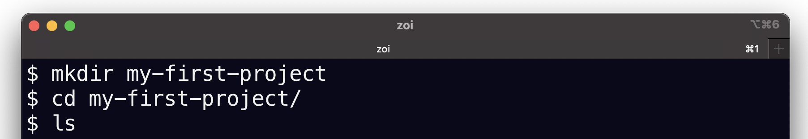

+++

Il est très courant de mettre, dans un nouveau projet, un fichier de *readme* qui va donner des informations diverses sur le répertoire et les fichiers de ce répertoire...

Ca peut être un simple fichier de texte mais autant utiliser, pour ce que ce soit plus joli et plus *dans l'air du temps*, la syntaxe simple des fichiers *markdown*.

On va donc créer un fichier `readme.md`; notons qu'on va le faire dans ce notebook, de manière super simple en redirigeant un petit morceau de texte dans un fichier de nom `readme.md`. Mais vous pouvez aussi ouvrir `vs-code` et y éditez vos fichiers (attention à bien les mettre dans le répertoire `my-first-project` !

Nous allons faire un magnifique projet qui calcule la fonction factorielle, puisque la difficulé ici ne réside pas dans le code mais bien dans son organisation, restons simples.

Nous créons un fichier `readme.md` en redirigeant, avec $>$ une chaîne de caractère, dans le fichier `readme.md`

+++

```bash
echo "ce répertoire est réservé à l'implémentation d'une fonction factorielle" > readme.md
```

+++

Il est important aussi de définir un fichier de licence afin d'expliquer les droits des personnes qui utiliseront un jour votre code. Nous ne nous appesantissons pas là dessus aujourd'hui.

+++

```bash
echo "Licence machin truc chose, Prénom Nom" > licence.txt
```

+++

Vous pouvez lister avec `ls` ou `ll` les fichiers de votre répertoire:

+++

```bash
$ ll
total 8
4 -rw-r--r-- 1 vr vr 39 Sep  5 14:54 licence.txt
4 -rw-r--r-- 1 vr vr 77 Sep  5 14:46 readme.md
```

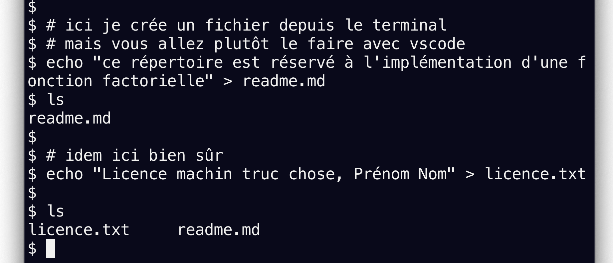

+++

## version de la commande (`git version`)

+++

toutes les commandes de git sont de cette forme

```bash
git subcommand [options] [arguments]
```

+++

pour commencer, on va afficher la version de `git` qui est installée avec cette première sous-commande `version`

```bash
$ git version
git version 2.30.1
```

si vous n'avez pas exactement la même version, aucun souci, on n'utilisera aucune fonction avancée ni récente de `git`,  donc plus ou moins toutes les versions de `git` conviennent pour ce cours.

+++

## on transforme le dossier en dépôt (`git init`)

+++

On revient à notre répertoire. Nous y avons deux fichiers. 

Nous allons **transformer ce dossier en dépôt** (ou *repository*) en l'initialisant avec la commande `init` de `git`

+++

```bash
git init
Initialized empty Git repository in /home/alice/my-first-project/.git/
```

+++

Voilà ,vous avez créé un dépôt (ou *repository*, ou encore on dira aussi parfois *repo*), un dépôt `git`, qui pour commencer est **vide**. Non, les fichiers du répertoire n'ont pas été mis automatiquement dedans !

+++

Comme pour toutes les commandes du système, de très nombreuses options sont disponibles, à consulter dans la documentation; vous pouvez par exemple faire pour cela `git init --help`

+++

```bash
git init --help
```

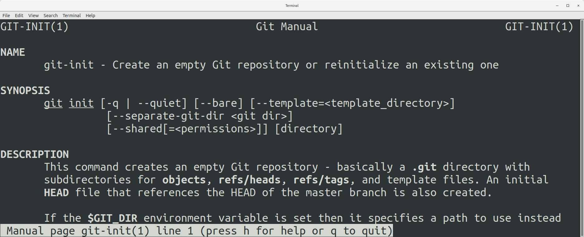

+++ {"tags": ["level_intermediate"]}

Souvent à ce stade, les gens déjà exposés à l'informatique se demandent: *mais bon sang mais qu'est-ce ça fait au juste ce `git init` ?*  
si c'est votre cas et pour satisfaire votre curiosité, tapez d'abord `ls` pour voir le contenu du dossier courant

```bash
$ ls
licence.txt	readme.md
```

`ls` nous montre toujours les deux mêmes fichiers ! mais alors, où est le répertoire de travail de *git* ici ? en fait il est *caché*. Par convention, les fichiers dont le nom commencent par un `.` sont un peu plus durs à voir que les autres; on peut les voir en passant à la commande `ls` l'option `-a`

```bash
$ ls -a
.		..		.git		licence.txt	readme.md
```

qui nous montre plusieurs entrées de plus que `ls` tout court:

1. `.` c'est le répertoire courant,
1. `..` est son répertoire parent, et
1. `.git` est le répertoire de travail de `git`

mais maintenant que vous avez vu ce répertoire `.git`, on **l'oublie entièrement**, car ce n'est qu'un détail d'implémentation qui n'a aucune importance surtout à notre niveau actuel.

il est beaucoup plus important de se familiariser avec le modèle mental des objets de `git`, que de savoir en détail comment tout ça est rangé sur le disque

+++

## l'état du répo (`git status`)

+++

Reprenons; maintenant si nous voulons voir où on en est de notre tout nouveau dépôt, son état, on va utiliser la commande `git status`; je vous montre une copie d'écran pour qu'on voie bien les couleurs

```bash
git status
```

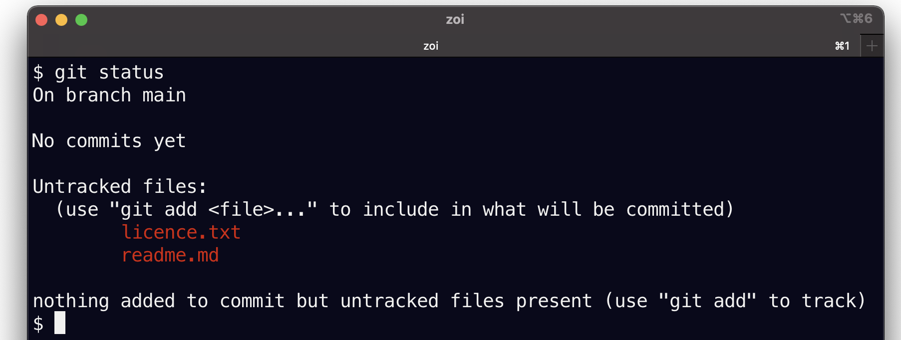

+++

Ce message vous dit plusieurs choses que nous allons détailler.

+++

***
***On branch main***

Dans un dépôt git, il y a toujours la notion de branche courante; on y reviendra, retenons pour l'instant qu'à la création du dépôt, on nous crée une branche qui s'appelle `main`, et qui est la branche courante 

**note:** depuis quelque temps, la branche créée par défaut  
**s'appelle `main`** et non plus `master`

+++

***
***No commits yet***

Une autre information très intéressante: git vous dit que vous n'avez pas encore créé de **commit** !

Faisons un peu de terminologie parce que `git` c'est super bien mais parfois un peu abscond, il faut s'habituer à son vocabulaire (donc on va insister un peu lourdement).

Le **commit** désigne une *version enregistrée* du projet, une sorte de *sauvegarde* ou encore de *snapshot* (un instantané) de votre projet **tout entier** à un instant (un peu comme le `backup1.zip` d'Alice dans les transparents)

Bon là clairement on n'a encore rien mis sous gestion de version (vu qu'on n'a rien fait depuis l'initialisation). Donc on n'a pas de **commit**, le **repo** est tout vide.

+++

***
***Untracked files***

Il faut aussi savoir qu'un répertoire (dossier) sous gestion de version `git` peut contenir des fichiers *de brouillon*, que vous **ne voulez pas mettre** sous gestion de version (vous n'êtes pas obligés de mettre tous vos fichiers locaux dans votre dépôt !).

C'est ce qu'on nous signale ici: nos deux fichiers sont, à ce stade, considérés comme *untracked*, évidemment puisqu'on n'a encore rien fait depuis l'initialisation de notre repo `git` local.

Les fichiers (de votre répertoire courant) qui ne sont **pas sous gestion de version** sont appelés ***untracked*** et ils sont en **rouge**. Ici donc `licence.txt` et `readme.md`, on s'y attendait.

+++

***
***use "git add <file>..." to include in what will be committed***

Enfin `git` nous dit que, pour ajouter des fichiers dans ce qui fera partie du prochain **commit** (*to include in what will be committed*) nous pouvons utiliser la commande `git add`.

+++

## ajout de fichiers sous gestion de version (`git add`)

+++

Et bien on le fait: on va ajouter des fichiers pour le premier commit.

On met le premier fichier:

```bash
git add readme.md
```

Que vous dit `git` ? Rien ! Il n'est pas très locace. Comment pouvons nous voir ce qui s'est passé ? oui en demandant le statut du repo avec `git status` !! Alors voilà j'ai vraiment besoin d'une copie d'écran, les couleurs sont très importantes:

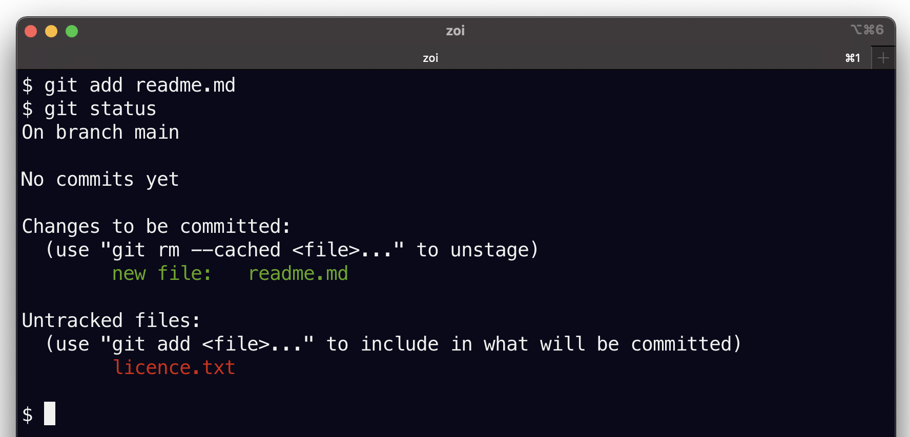

Voilà, maintenant `git status` vous montre
* le fichier `readme.md` en **vert** dans la partie des **modifications qui seront committées**,
* le fichier `licence.txt`, quant à lui, est resté en rouge.

Remarquez bien qu'on *n'a toujours aucun commit dans ce dépôt*; la commande `git add` nous permet seulement de **préparer** le prochain commit.

+++

Maintenant on va ajouter le second fichier :

```bash
git add licence.txt
```

À votre avis que va vous afficher `git status` à ce stade ? commencez par réfléchir, puis essayez sur votre ordi.

vous devez voir :

* qu'on n'a toujours pas de commit, bien sûr
* que les deux fichiers fichiers apparaissent maintenant en vert dans la section *Changes to be committed*
* et enfin qu'il n'y a plus de *untracked files*

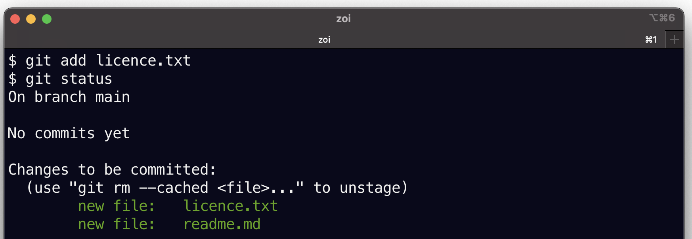

+++

## premier `git commit`

+++

Maintenant on va créer notre premier **commit**.

+++

Le principe du contenu d'un `git commit`:

* il va contenir tout ce qu'il y avait dans le commit précédent (bon nous ici, c'est un contenu vide...),
* plus ce qu'on a donné à la (ou les) commande(s) `git add` entretemps

Dans notre cas donc, notre premier commit va contenir les deux fichiers.

+++

Il va nous falloir **fournir un message** qui explique à quoi correspond ce commit. Ce message est **d'autant plus important** qu'il va nous servir à repérer l'idée derrière ce commit (*pourquoi on l'a fait*). 
Pour l'instant restons bêtement simple, par exemple nous allons mettre un message qui dit juste `licence+readme`.
Nous reviendrons ultérieurement sur les bonnes pratiques pour rédiger ces messages, mais une chose à la fois...

Donc nous y voilà, `git` a une commande `commit`, pour créer un commit; pour lui indiquer quel message mettre dans le commit, on peut soit :

* lancer juste `git commit`, et dans ce cas-là un éditeur de code va se lancer automatiquement; on est censé écrire le message dans le fichier, puis sauver et quitter; le truc c'est que vous n'êtes pas forcément confortable avec l'éditeur par défaut (notamment si c'est `vi` qui est notoirement cryptique); notez aussi qu'on peut choisir, une bonne fois pour toutes, 
un autre éditeur comme par exemple `nano` avec la commande `git config --global
core.editor "nano"`
* donc pour l'instant on va laisser cette option-là de coté, et indiquer le message à `git commit` directement **sur la ligne de commande** avec l'option `-m`; et en plus depuis le notebook, c'est plus simple aussi de donner le commentaire sur la ligne de commande.

+++

ce qui donne ceci, pour créer notre premier commit

+++

```bash
$ git commit -m"licence+readme"
[main (root-commit) 01b0604] licence+readme
 2 files changed, 2 insertions(+)
 create mode 100644 licence.txt
 create mode 100644 readme.md
```

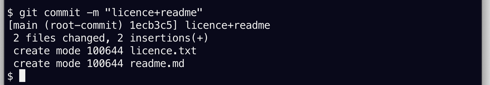

+++

N'essayons pas de comprendre les messages trop cryptiques, nous y reviendrons plus tard, retenons juste que les 2 fichiers ont été créés dans le commit, et nous sommes contents.

+++

## réparer la perte de fichiers

+++

Avant d'aller plus loin, et pour vous convaincre de l'intérêt d'avoir fait ce commit, imaginez qu'à ce stade vous perdez accidentellement vos fichiers (un `rm *` non-intentionnel est si vite arrivé...)

```bash
       # OOPS !
       # une fausse manipe ...
$ rm *

       # on dirait qu'on a tout perdu ?
$ ls

       # mais en fait non, dans ce simple commit on a tout
       # ce qu'il faut pour remettre les choses en état
$ git restore -- readme.md licence.txt

       # et voilà
$ ls
licence.txt	readme.md

```

+++

## la branche courante

+++

Essayons maintenant `git status`

```bash
$ git status
On branch main
nothing to commit, working tree clean
```

+++ {"cell_style": "split"}

Revoilà ce terme de **branch `main`**. Nous pouvons maintenant expliquer plus en avant:
une **branch** est une **référence vers un commit** i.e. *elle nous indique un commit*, on
pourrait dire aussi quelque chose comme "*elle pointe vers un commit*".

Avec `git` on a **toujours** la notion de **branche courante** pour savoir où on
travaille. À l'**initialisation** d'un dépôt la **branche courante** porte par convention
le nom de **`main`** (ou plus récemment, **`main`**)

D'autre part quand vous créez un commit, la branche courante "avance" pour désigner le
nouveau commit.

Donc dans notre cas, et tant qu'on ne crée pas de nouvelle branche, `main` va toujours
désigner le dernier commit.

+++ {"cell_style": "split"}

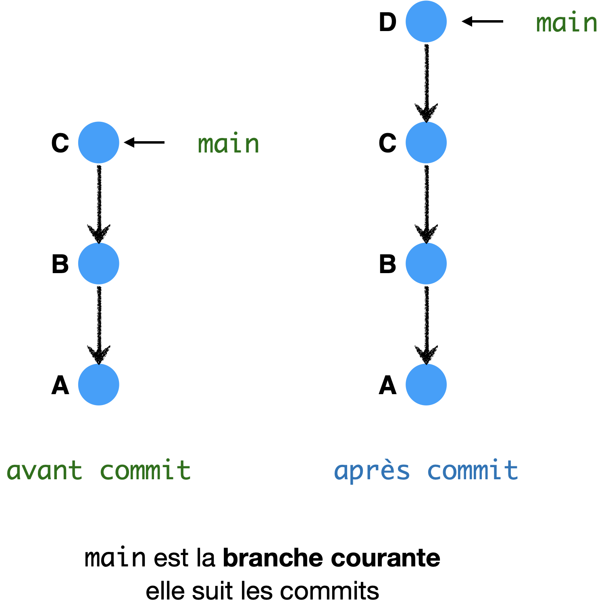

+++

## les trois parties (fichiers + index + commits)

+++

Revenons à l'état de notre dépôt; `git status` nous dit aussi qu'il n'y a plus rien à commiter. Et bien modifions un des deux fichiers - par exemple le `readme.md` - et ajoutons le dans le prochain commit en préparation.

+++

``` bash
echo "la licence d'utilisation est dans le fichier licence.txt" >> readme.md
```

(ici avec cette commande un peu absconse on a juste ajouté une ligne dans le fichier `readme.md`; dans vos manipulations vous pouvez utiliser vs-code par exemple pour faire la même chose)

+++

Je l'ajoute dans le prochain commit:

```bash
git add readme.md
```

+++

Maintenant on va **attendre un peu avant de faire `git commit`**.

Au contraire on va modifier localement `licence.txt`, et pour bien illustrer l'état de mon dépôt, je ne le rajoute **pas** au commit courant.

```bash
echo "la licence sera spécifiée ultérieurement" >> licence.txt
```

+++

Enfin, créons aussi le fichier `fact.py` pour y implémenter la fonction factorielle en Python. Là aussi on va être rapide, on utilise la fonction `echo` de `bash` pour rediriger les deux lignes suivantes`"def (n):` et `    pass"`  dans le fichier `fact.py`. 

```bash
echo "def fact (n):" > fact.py
echo "    pass" >> fact.py
```

Bien sûr, de votre côté vous pouvez à la place éditer ce fichier avec `vs-code` pour y mettre juste

```python
def fact (n):
    pass
```

+++

Donc maintenant où en est-on ?

* Du coté des **fichiers**, nous avons fait

    * deux changements, en fait des ajouts de lignes -  
      l'une dans `readme.md`, l'autre dans `licence.txt`
    * une création, avec `fact.py`

* Du coté du **dépôt**

    * on est sur la branche courante `main`, qui pointe vers le dernier commit réalisé
    * et on a commencé à préparer un futur commit, qui inclut le changement dans `readme.md`.

+++

Faisons `git status` afin de comprendre

```bash
git status
```

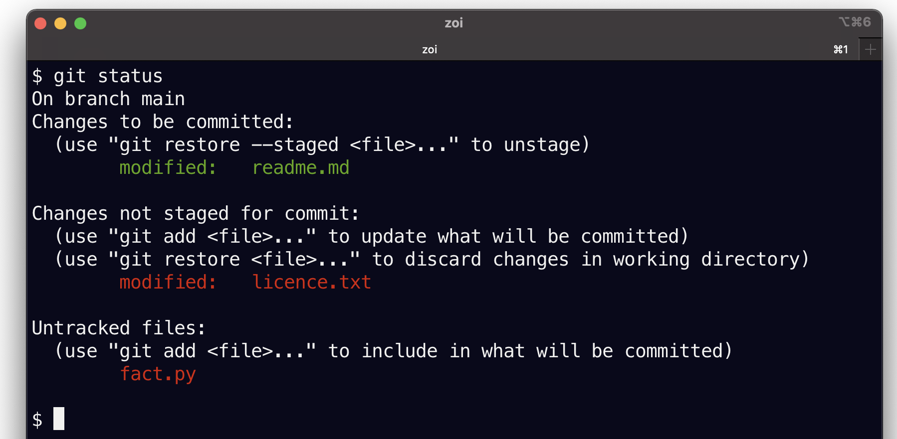

+++

Nous voyons là les trois états des **fichiers** de notre répertoire courant:


   1. les fichiers **sous** gestion de version, **modifiés** depuis le dernier commit et **ajoutés** pour le prochain commit ici `readme.md`
   1. les fichiers **sous** gestion de version, **modifiés** depuis leur dernier commit et **non ajoutés** ici `licence.txt`
   1. les fichiers qui ne sont **pas sous** gestion de version, ici `fact.py`

+++

Nous pouvons maintenant décrire les **3 morceaux** de notre répertoire git:


   - l'`espace de travail` avec tous les fichiers au sens usuel (ce que vous voyez dans l'explorateur de fichiers et dans votre éditeur de code), qui peuvent contenir un certain nombre de modifications par rapport au dernier commit
   - l'`index` (ou `stage`) dans lequel on ajoute - avec `add` - certaines de ces modifications - et pas forcément toutes; l'index sert à préparer le prochain commit; dit autrement, quand on crée un commit, on fait un snapshot de ce qu'il y a dans l'index;
   - votre repository local `git` qui contient tous vos commits

+++

On voit qu'une fois qu'un changement a été fait sur un fichier source, `git add` permet de mettre le changement dans l'index. Ce qui est le cas de `readme.md`, mais pas de `licence.txt` qui n'est pas dans l'index comme nous le dit `git status`

Une fois qu'on est satisfait du contenu de l'index, avec `git commit` on crée un commit qui sera **identique** à l'index.

+++

## `index` et abus de langage

+++

Faites **attention** car:

cette zone de préparation du prochain commit s'appelle indifféremment l'***index*** ou le ***stage*** - et oui, ce serait mieux s'il n'y avait qu'un nom, mais bon, c'est comme ça :)

mais bref, les deux termes de *index* et *stage* sont **totalement interchangeables**

+++

il faut insister également sur le fait que, lorsqu'on parle de l'index

* parfois on fait référence à **son contenu**
  comme dans: "après un commit, l'index est égal au nouveau commit"

* parfois on fait référence **aux changements** par rapport au dernier commit
  «l'index est vide» ⇔ «l'index correspond au dernier commit»

+++

## pourquoi un index ?

+++

si on devait imaginer un *workflow* sans index, ça donnerait ceci :

<video width="800px" controls src="media/manim-NoIndex.mp4" type="video/mp4"></video>

+++

grâce à l'index on peut choisir quels changements mettre ou pas dans le commit :

<video width="800px" controls src="media/manim-WithIndex.mp4" type="video/mp4"></video>

+++

## deuxième commit

+++

Reprenons; à ce stade pour notre part nous allons créer un second commit avec les deux modifications - celles de `readme.md` **et** celles de `licence.txt`

Il ne nous reste donc qu'à ajouter `licence.txt` à l'`index` où nous avions déjà ajouté `readme.md`.

```bash
git add licence.txt
```

+++

Puis nous faisons notre deuxième `commit`:

```bash
$ git commit -m"informations sur la licence"
[main 31c4816] informations sur la licence
2 files changed, 4 insertions(+)
```

+++

## `git log`

+++

Maintenant que nous avons fait deux commits, nous aimerions voir l'historique de notre dépôt. Il existe une commande pour cela qui vous donne la liste des commits avec des informations très importantes; `git log`, c'est le journal de bord, le rapport des commits du projet.

```
git log
commit 31c4816dd90653fc1839b72a4dc0d504656586d9 (HEAD -> main)
Author: Alice <alice@email.fr>
Date:   Sat Sep 26 21:54:38 2020 +0200

    informations sur la licence

commit 01b060423e149d52c3d10e6c893ff416d8f2647b
Author: Alice <alice@email.fr>
Date:   Sat Sep 26 21:51:27 2020 +0200

    licence+readme
```

+++

Vous voyez la liste des commits du plus récent au plus ancien.

Pour chaque commit, vous avez:
  - son identifiant unique (le looooooong nom orange)
  - l'auteur du commit
  - la date du commit
  - le message

+++ {"tags": ["level_intermediate"]}

## identifiant d'un commit: le `SHA-1`

+++ {"tags": ["level_intermediate"]}

On parle rapidement de l'identifiant d'un commit comme `34269b459201f87b65e7c47b89c93a99a8c0b4e6`
* il doit être **unique** dans un projet
* on doit pouvoir faire des très nombreux commits dans un projet qui peut durer des années.

Ils ont choisi de prendre des entiers écrits en base `16` et en codage hexadécimal, on utilise les 16 chiffres `0`, `1`, ..., `9`, `a`, `b`, `c`, `d`, `e`, `f` où `a = 10` et `f = 15` (ainsi par exemple `FF = 15*16 + 15 = 255` et oui on peut utiliser des miniscules ou des majuscules).

Comme vous le voyez, cet identifiant est assez long (40 chiffres hexadécimaux) cela afin d'assurer de son unicité. Il s'appelle le **hash** du commit, ou encore son **sha1** - prononcer *chat-ouane*.

On calcule rapidement:
  - un caractère hexadécimal a $16$ valeurs, il se code sur $4$ bits ($2^4$)
  - on a $40$ caractères hexadécimaux
  - ça fait donc $40*4$ bits, donc $2^{160}$ *hash* (nombres) différents
  - on est dans l'ordre de $10^{50}$.

C'est tellement grand, qu'en général, 7 caractères suffisent à disambigüer les commits dans un dépôt (c'est vrai que $2^{7*4} = 2^{28} = 268.435.456$, le nombre de suites de 7 digits hexadécimaux, c'est déjà assez grand pour que les conflits soient rares). Aussi souvent, on n'utilisera que les $7$ premiers caractères du sha-1.

+++

## que signifie `HEAD` ?

+++

Signalons tout de suite une présentation qui sera plus pratique, où chaque commit fait l'objet d'une ligne du rapport

```bash
git log --oneline
```


+++

On voit maintenant apparaître le nom `HEAD`:

* `HEAD` c'est (comme les branches) une **référence** vers un commit;   
  un peu comme une variable désigne un objet en Python,  
  une référence en git c'est un nom qui désigne un commit

* `HEAD` est une référence spéciale, une sorte de mot-clé,  
  qui **désigne toujours le commit courant**, i.e. celui sur lequel vous travaillez

* `HEAD` donc il désigne toujours (le même commit que) la branche courante;  
  sauf que, on le verra bientôt, on crée facilement plusieurs branches dans un repo  

  et donc le commit courant:
    * n'est *pas toujours* désigné par la référence `main`  
      (parce que ce n'est pas toujours la branche courante),
    * mais il est *toujours* désigné par `HEAD`

+++

Voici une illustration; on a anticipé un petit peu, on a imaginé le cas où on serait sur une branche `devel` (un peu de patience), pour montrer la logique que suivent les références lorsqu'on fait un commit :

* `HEAD` et la branche courante *avancent* pour suivre le cours du projet et désigner le dernier commit


* alors que les autres branches quant à elles restent fixes

+++ {"cell_style": "split"}

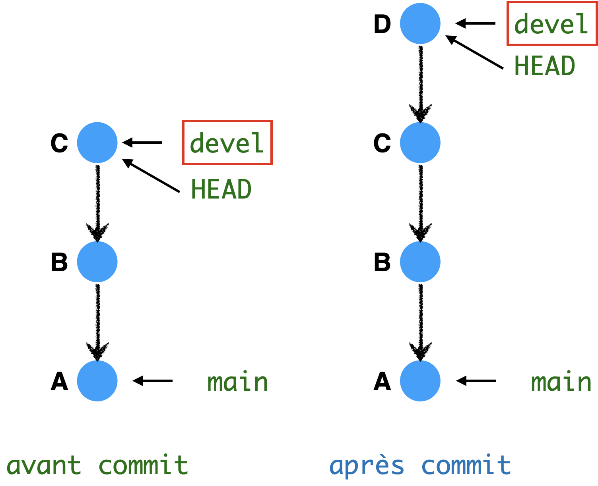

+++ {"cell_style": "split"}

ici la branche courante est `devel`

`HEAD` désigne toujours **la branche courante** (même si celle-ci ne s'appelle pas `main`)

après le commit les deux sont montées

remarquez qu'ici `main` est restée au même endroit car elle n'est **pas** la branche courante

`main` n'aurait pas bougé non plus même si elle avait référencé (pointé sur) le commit `C`

+++

Pour revenir à notre cas

```bash
$ git log --oneline
31c4816 (HEAD -> main) informations sur la licence
01b0604 licence+readme
```

on voit ici, avec le fragment `HEAD -> main`, que les deux références pointent vers le deuxième commit - qui apparaît en premier parce que c'est plus pratique de voir le plus récent d'abord

les deux sont montées de concert. La prochaine fois que nous ferons `git commit`, ce nouveau *commit* sera lié à `HEAD` puis `HEAD` montera d'un cran pour désigner ce nouveau commit, et `main` fera de même.

la mention `(HEAD -> main)` nous indique que c'est `main` la branche courante

+++

## troisième commit

+++

Puis ajoutons le fichier contenant la factorielle et créons un commit.

```bash
$ git add fact.py
$ git commit -m"première implémentation de factorielle dans le fichier fact.py"
[main e2c02ca] première implémentation de factorielle dans le fichier fact.py
 1 file changed, 2 insertions(+)
 create mode 100644 fact.py
```

Nous voyons qu'un fichier a été créé dans le repo pour `fact.py`

+++ {"tags": ["level_intermediate"]}

N'essayez pas de comprendre le nombre qui apparaît après `create mode` là ca veut simplememnt dire que `fact.py` est un `Regular non-executable file`.

+++

Refaisons un `git log --oneline` pour y voir plus clair:

```bash
$ git log --oneline
e2c02ca (HEAD -> main) première implémentation de factorielle dans le fichier fact.py
31c4816 informations sur la licence
01b0604 licence+readme
$
```

+++

## checkpoint (perdu dans l'état de votre repo ?)

+++

Si votre `git log --oneline` correspond au nôtre, sautez cette cellule.

Sinon: pas de panique ! Cette cellule reprend toutes les commandes qui ont modifié votre repository `git`. Coupez ces lignes et collez les dans un terminal.

Vous aurez un second sous-répertoire cette fois nommé `my-first-project-2`:

<div style="font-size: 1vw; line-height:1.1;">

```bash

# on a créé un répertoire et on s'y est déplacé
mkdir my-first-project
cd my-first-project

# on a créé un fichier readme.md
echo "ce répertoire est réservé à l'implémentation d'une fonction factorielle" > readme.md

# on a créé un fichier licence.txt
echo "Licence machin truc chose, Prénom Nom" > licence.txt

# on a initialisé notre repository git
git init

##### 1-er commit
# on a ajouté les fichiers readme.md et licence.txt dans l'index
git add readme.md licence.txt

# on a créé notre premier commit
git commit -m"licence+readme"

##### 2-ème commit
# on a modifié le fichier readme.md
echo "la licence d'utilisation est dans le fichier licence.txt" >> readme.md
# on l'a ajouté dans l'index
git add readme.md

# on a modifié notre fichier licence.txt
echo "la licence sera spécifiée ultérieurement" >> licence.txt

# on a créé un fichier fact.py
echo "def fact (n):" > fact.py
echo "    pass" >> fact.py

# on a rajouté le fichier de licence.txt dans l'index
git add licence.txt

# on a créé un second commit (sans mettre fact.py)
git commit -m"informations sur la licence"

##### 3-ème commit
# on a ajouté fact.py dans l'index
git add fact.py

# on a fait un troisième commit
git commit -m"première implémentation de factorielle dans le fichier fact.py"

# on en est là
git log --oneline
```
</div>

+++

## fichiers du repo (`git ls-files`)

+++

À cet instant peut-être ne vous rappelez-vous plus très bien des fichiers qui sont sous gestion de version dans ce repository `git`.

Vous pouvez alors les lister en utilisant la commande `git ls-files`.

```bash
$ git ls-files
fact.py
licence.txt
readme.md
```

Voilà ce sont ces 3 fichiers. Que feriez-vous si vous vouliez savoir lequels ont été modifiés depuis le dernier `git commit` ?

Oui vous feriez un `git status` !

+++

## différences des versions de fichiers (`git diff`)

+++

Maintenant nous allons éditer le fichier `fact.py` et modifier le code de la factorielle de façon à écrire une version qui fonctionne; utilisez votre éditeur de code pour modifier `fact.py` comme ceci :

```python
def fact (n):
    if n == 1:
        return 1
    else:
        return n*fact(n-1)
```

+++

Savoir les différences à propos d'un fichier que vous modifiez (comme `fact.py`) est quelque chose d'indispensable, que nous allons expérimenter. Pour cela `git` propose la commande `diff`.

+++

Du fait de la présence de l'`index`, il y a deux classes de différences

* celles entre les fichiers et l'index
* celles entre l'index et le commit courant
(les commits sont tous dans le repo)

la commande `git diff` vient en deux versions (avec ou sans l'argument `--cached`) qui permettent de montrer ces deux classes de différences

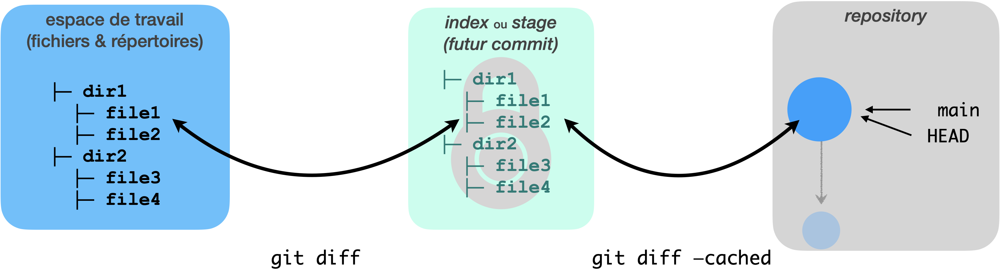

+++

Expérimentons cela

Regardons d'abord ce que donne `git diff` sur le fichier `readme.md`, auquel on n'a pas touché, et qui donc est identique dans le répertoire, dans l'index et dans le commit (courant, on va commencer à ne plus répéter le mot à chaque fois que ce sera implicite) :

```bash
git diff readme.md
git diff --cached readme.md
```

On n'a trouvé aucune différence, comme attendu, c'est très bien.

+++

Regardons maintenant la sortie de `git diff` sur `fact.py`, qui a été **modifié** localement mais **pas ajouté** à l'index :

```bash
git diff fact.py
```

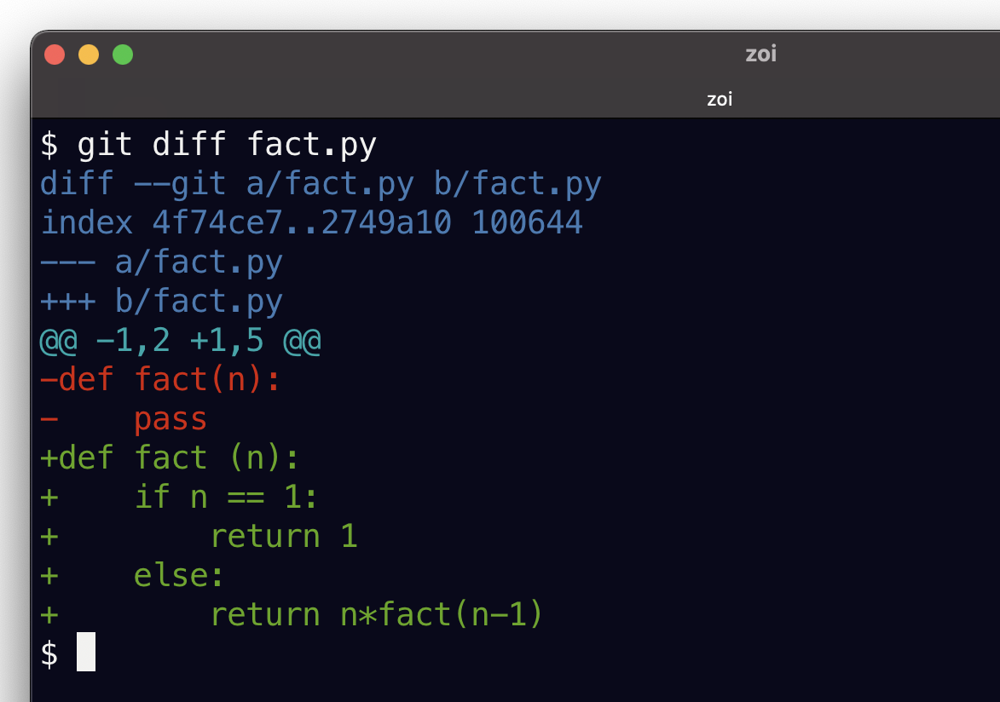

La sortie de `git diff` contient
   - en **- rouge** les lignes supprimées (ici `pass`)
   - en **+ vert** les lignes ajoutées (ici le corps de la fonction)
   - entre `@@` et `@@` des informations que vous pouvez ignorer (à destination d'outils graphiques, qui savent ainsi retrouver le contexte)

+++

Et, comme on n'a rien ajouté dans l'index à propos de `fact.py`, si maintenant on demande les différences sur `fact.py` entre l'index et le commit (en utilisant l'option `--cached`), on observe qu'il n'y a en effet pas de différence :

```bash
git diff --cached fact.py
```

+++

À ce stade les différences de `fact.py` nous conviennent, on va **maintenant les ajouter dans l'index**, et inspecter à nouveau les différences

```bash
git add fact.py
```

+++

Le `diff` entre le fichier `fact.py` et l'`index`ne dit plus rien:

```bash
git diff fact.py
```

+++

Le `diff` entre l'`index` et le commit courant montre les différences:
```bash
git diff --cached fact.py
```

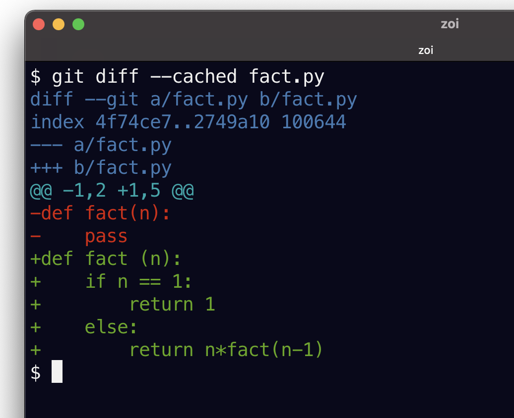

La situation est exactement l'inverse que tout à l'heure :
* il n'y a plus à présent de différences entre le fichier et l'index
  `git diff` ne trouve rien
* et tous nos changements se retrouvent maintenant dans la seconde classe de changements,
  et sont donc rapportés par `git diff --cached`

+++

## l'extension git de vs-code

+++

Naturellement ça n'est pas forcément super-pratique de passer son temps à taper `git diff` et `git diff --cached` pour savoir où on en est

Et donc, maintenant qu'on a compris à quoi correspondent ces deux familles de changements, on va aller utiliser l'extension git de vs-code pour voir comment c'est présenté dans cet environnement.

Je lance donc vs-code en tapant

```bash
$ code .
```

Le `.` permet que `vs-code` *voit* votre répertoire courant.

+++

J'arrive sur l'écran habituel où je localise l'*extension git* sur le coté gauche (pas besoin d'installation spécifique)   
J'active cette extension en cliquant la zone indiquée par la flèche rouge

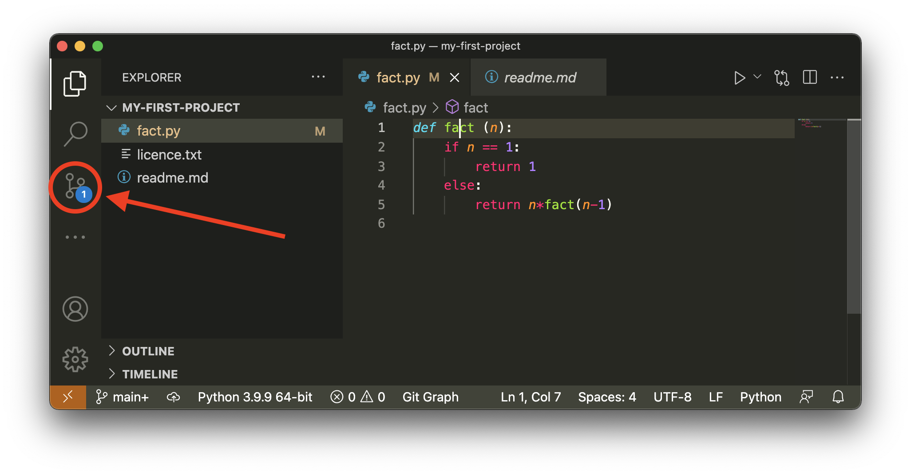

+++

Et je vois ceci - je rappelle qu'on a tous les changements de `fact.py` dans l'index :

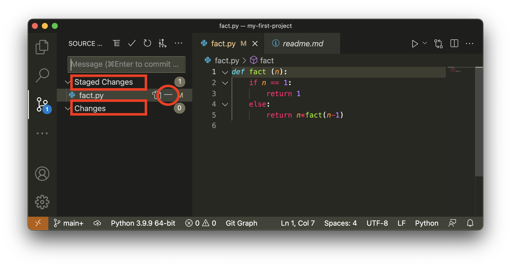

+++

c'est là que c'est intéressant, parce que justement il y a deux rubriques pour afficher les différences, qui correpondent exactement à ce qu'on vient de voir

* *Staged changes* va nous montrer les différences entre le commit et l'index
  (comme `git diff --cached` donc)
* *Changes* va nous montrer les différences entre les fichiers et l'index
  (comme `git diff` donc)

et donc nous ici la deuxieme rubrique est vide

+++

remarquez le bouton marqué `-` (entouré); c'est un bouton qui permet de défaire l'action de `add` (c'est pour ça qu'il affiche `-`) sur le fichier `fact.py`

nous n'avons pas encore appris à faire ça avec la ligne de commandes, mais amusons-nous à le faire, on clique sur ce bouton et maintenant on voit ceci

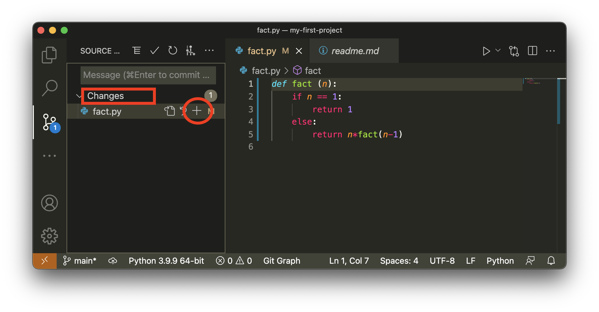

cette fois on ne voit plus qu'une rubrique - pas forcément très cohérent comme choix de la part de vs-code - comme l'index est vide, on ne nous affiche pas du tout la rubrique *Staged Changes*

quoi qu'il en soit, on peut maintenant réajouter les changements, avec .. eh oui le bouton `+`, et on se retrouve dans le même état qu'au début de cette section - tous les changements sont dans l'index

+++ {"tags": ["level_advanced"]}

pour les curieux, sachez qu'on peut parfaitement ajouter/enlever dans l'index des changements au niveau de granularité de la ligne ! voici une session pour vous donner une idée;

<video width="800px" controls src="media/vscode-line-by-line.mp4" type="video/mp4"></video>

ça n'est clairement pas crucial à ce stade de maitriser cette technique, mais sachez que c'est quelque chose que les codeurs font de manière totalement routinière, car ça permet de faire **des commits qui ont du sens**, et non pas un ramassis de modifications qui ne sont pas reliées entre elles.

+++

## quatrième commit

+++

Maintenant qu'on a bien compris les deux classes de changements dits "pendants", nous allons créer un 4-ème commit; pour ça vous avez le choix :

* sur la ligne de commandes, comme on l'a fait jusqu'ici

```bash
git commit -m"une implémentation plus juste de la fonction factorielle"
```

* ou avec vs-code, si vous voulez expérimenter plus en avant l'usage de cet outil

<video width="800px" controls src="media/vscode-commit.mp4" type="video/mp4"></video>

dans les deux cas, utilisez  `git status` et `git log` pour vérifier que votre dossier est identique au dernier commit (vous n'avez plus de changements pendants, dans aucune des deux catégories de changements) et que vous avez 4 commits

+++

## le graphe des commits (`git log --graph`)

+++

Nous commençons à avoir quelques commits, bientôt nous créerons des branches et auront des graphes de `commits` (sans cycles), voilà le moment de montrer l'option `--graph` de la commande `log`.

```bash
$ git log --oneline --graph
```

Alors pour l'instant ça ne fait que d'ajouter une petite étoile sur le coté gauche, mais c'est ça qui nous permettra de bien suivre les branches lorsqu'on en verra ! (*Notons qu'entre une figure et une autre, les `sha-1` peuvent ne pas être cohérents: les figures proviennent de plusieurs essais de repos).*

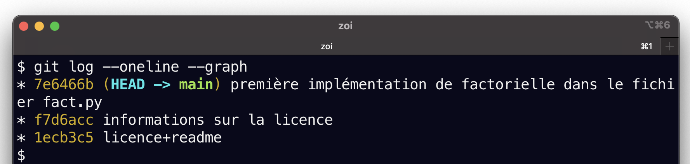

+++

Sachez que vous pouvez (facilement) définir des raccourcis dans la configuration globale de `git`.

Par exemple si je veux taper `git lg` à la place de `git log --oneline -- graph`, 
je vais definir un `alias` qui s'appelle `lg` pour `log --oneline -- graph`
(qui existera *une bonne fois pour toutes*) de la manière suivante:

```bash
git config --global alias.lg "log --oneline --graph"
```

Du coup c'est plus rapide à utiliser:
```bash
git lg
```

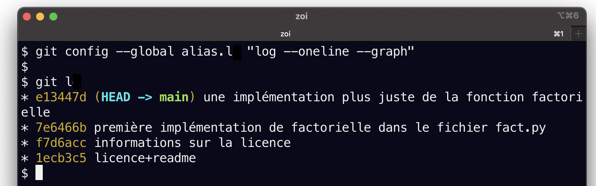

+++

Mais reprenons l'étude du graphe : dans le modèle de données de git, chaque commit possède 1 ou plusieurs **parents** (ou 0 dans le cas particulier du tout premier commit) : ce sont les commits qui ont servi de base pour le construire.

Dans notre cas avec `my-first-project`, sans compter le commit initial, nous avons 3 commits qui ont chacun exactement un parent.

Pour illustrer un peu mieux, voyons un graphe un peu plus intéressant - on ne saurait pas encore construire un dépôt de ce genre, mais on en verra bientôt.

+++ {"cell_style": "split"}

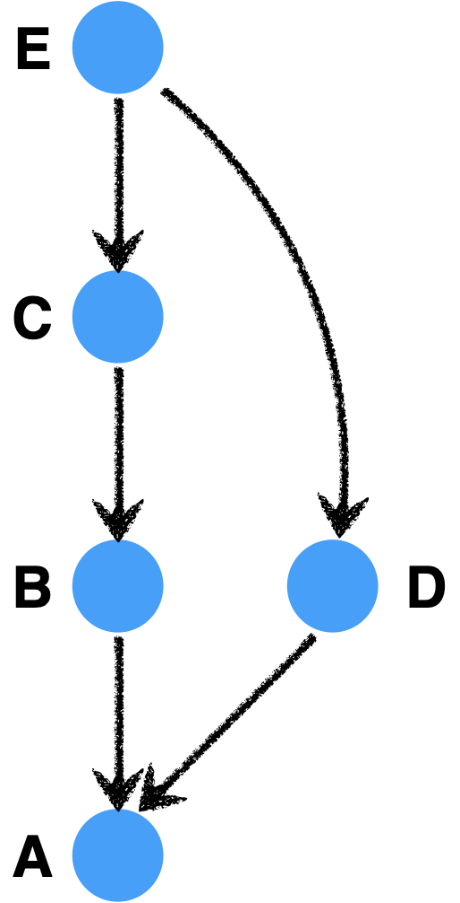

+++ {"cell_style": "split"}

Dans ce graphe, où **`A`** est le **commit initial**, nous avons

* `A` qui n'a pas de parent
* `B`, `C` et `D` qui ont chacun un parent (resp. `A`, `B` et `A`)
* `E` qui a deux parents, `C` et `D`

**Note** c'est arbitraire, mais dans tout le cours, on représente les commits **les plus récents en haut**; ça correspond à la sortie par défaut de `git log`; un peu comme aussi les logiciels de messagerie, c'est pratique de voir les derniers événements en haut...

+++

En fait, il est très important de savoir qu'un commit est par construction **immutable**. Ça signifie qu'une fois qu'il est créé, on ne peut plus jamais le modifier. Et au moment où on le crée, on connaît ses parents, mais on ne connaît pas encore ses futurs fils.

C'est pourquoi si on parcourt le graphe en partant de `E`, on peut facilement de proche en proche parcourir tous les autres commits; `E` contient les `SHA-1` de `C` et de `D`, `C` celui de `B`... En partant de `A` au contraire, on ne peut pas "remonter" dans le graphe, puisqu'il n'y a pas de référence vers ses fils (en arrière).

Voilà, vous avez compris: un commit connaît le·s commit·s à partir du ou desquel·s il a été créé et c'est tout, il ne connaîtra pas le·s commit·s qui seront créés à partir de lui.

+++

## comment désigner un commit ?

+++

Maintenant que nous avons plusieurs commits, nous allons voir comment naviguer dans ces commits. Par exemple pour revenir en arrière à une version précise du logiciel, c'est-à-dire à un commit connu (que vous allez repérer par son message).

Afin de demander à `git` de nous *remettre* sur un commit, on va devoir indiquer lequel.

En français on aurait envie de dire quelque chose comme: "*l'avant-dernier commit*". Mais bien sûr on parle à un ordinateur sur une ligne de commande, donc il nous faut une façon d'identifier les commits, et pour ça on a plusieurs manières:
   - votre commit courant s'appelle `HEAD`
   - un commit peut être référencé par une branche (dans notre cas la branche `main`)
   - un commit a un identificateur unique: son `sha-1`

En supplément de ces manières, `git` propose des mécanismes permettant de "*naviguer*" dans le graphe de commits avec `~` et `^`.

Ainsi par exemple, `HEAD` est le commit courant:
   - `HEAD~` est le premier parent de `HEAD`; donc l'avant dernier commit
   - `HEAD~2` est le premier parent du premier parent de `HEAD`
   
On peut utiliser `~` avec n'importe quelle référence, par exemple `main~`, ou `18b63f5~` si vous avez un SHA-1 qui vaut `18b63f5`.

+++

Prenons, comme exemple, les commits de `my-first-project`:
```bash
$ git lg
* afec18a (HEAD -> main) une implémentation plus juste de la fonction factorielle
* e2c02ca première implémentation de factorielle dans le fichier fact.py
* 31c4816 informations sur la licence
* 01b0604 licence+readme
```

* `HEAD` est donc le dernier commit (afec18a)
* `HEAD~` est l'avant dernier commit (e2c02ca)
* `main~2` est l'avant-avant dernier commit (31c4816)
* `e2c02ca~` est aussi l'avant-avant dernier commit (31c4816)
* ...

C'est plus pratique, pour la rédaction de ce cours, d'utiliser ce type de notation plutôt que d'insérer un SHA-1 en dur, parce qu'entre votre dépôt et le mien, les commits n'ayant pas été créés à la même date, ils n'ont pas le même SHA-1; donc si je veux écrire un script qui revient d'un commit en arrière et qui marche chez tout le monde, je vais utiliser `HEAD~` plutôt que `e2c02ca`.

+++ {"tags": ["framed_cell"]}

**exercice**

Entrainez-vous à utiliser ce mécanisme en conjonction avec `git log`

    git log --oneline HEAD
    git log --oneline HEAD~
    git log --oneline main~2

Vous remarquez que lorsqu'on passe, à `git log`, l'avant-avant-dernier commit (`git log --oneline main~2` ou `git log --oneline HEAD~2`), on ne nous montre plus **que deux commits** ! Pas de panique, le repo n'a pas changé, il contient toujours vos 4 commits.

**Mais** comme on indique à `git log` de parcourir de repo en commençant par le deuxième commit, eh bien comme corollaire de ce qu'on a vu plus haut (avec le graphe de parent et comment il est orienté), ce parcours-là ne peut découvrir que 2 commits.

+++ {"tags": ["level_advanced"]}

Nous avons vu qu'un commit peut avoir deux parents. Avec `~` on ne peut pas atteindre le second parent. Cela se fera fait en  utilisant `^`.

`^` est un peu particulier:
* `HEAD^`, il se trouve, désigne aussi, le premier parent
* `HEAD^2` va désigner le second parent de `HEAD`
* `HEAD^^` va désigner le parent du parent de `HEAD` $\approx$ `(HEAD^)^`
* dans `HEAD^^2` $\approx$ `(HEAD^)^2` avec `HEAD^` on va au premier parent puis, de là, on va au deuxième parent avec `^2`
* alors que `HEAD^2^` $\approx$ `(HEAD^2)^`

Et pourquoi ont-ils eu besoin de `~` parce que `HEAD~8` est plus simple à écrire que `HEAD^^^^^^^^`.

Nous pourrons ainsi naviguer dans les graphes, par exemple:

+++ {"tags": ["level_advanced"], "cell_style": "split"}

* `HEAD~2` désigne le parent du parent de `HEAD`
* `HEAD^2` désigne le deuxième parent de `HEAD`

autrement dit,

* *`X~`* est dans le sens de la hauteur, alors que
* *`X^`* travaille dans le sens de la largeur; ce qui est illustré sur la figure ci-contre

+++ {"tags": ["level_advanced"], "cell_style": "split"}

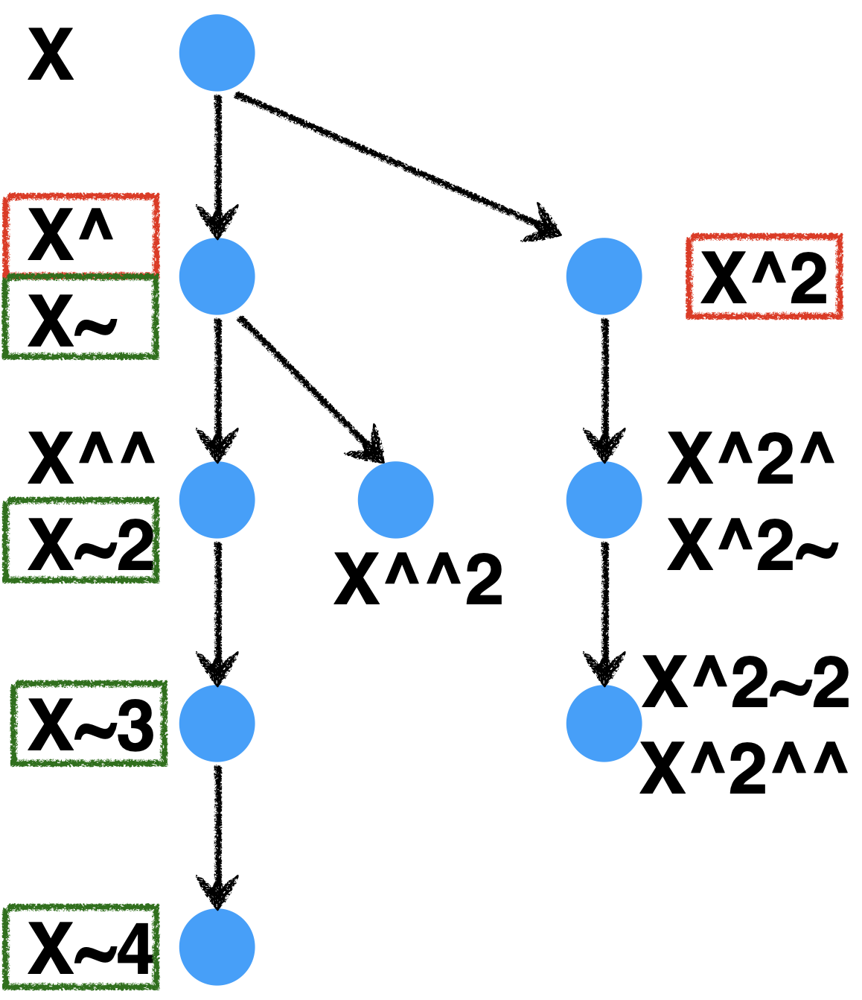

+++

## revenir en arrière dans les commits

+++

Imaginons qu'on a besoin de faire un changement, mais pas en partant du dernier commit (parce que ca on sait déjà le faire).

Pourquoi pourrait-on avoir besoin de faire ça ? ça semble bien compliqué...
mais en fait, une fois qu'on a appris à le faire, on se rend compte que ce n'est pas si compliqué, et que c'est une opération qui s'impose quand :

* on doit faire un opération de maintenance, sur le code de la v1.0 qu'on a publié il y a deux ans
* ou bien aussi lorsqu'on a commencé une nouvelle fonctionnalité (feature), qui prend du temps à finir, et qu'entretemps un bug a été trouvé. La version dans notre branche courante est toute cassée, ce n'est donc pas sur cette base qu'on veut corriger le bug, mais en repartant d'une version qui *marche* qui est *stable*

* et plein d'autres cas d'usage en fait...

+++

Allons-y, on va revenir sur l'avant dernier commit et faire des modifications à partir de là.

Pour faire cela, `git` nous oblige à:

* **créer une nouvelle branche**, et
* **changer de branche** pour aller sur la nouvelle branche.

Voyons ça pas à pas. Nous considérons que votre répertoire local est à jour avec le dernier commit.

+++

### gérer nos branches : `git branch`

+++

La commande `git branch` permet de lister, créer, détruire des branches

```bash
$ git branch
* main
```

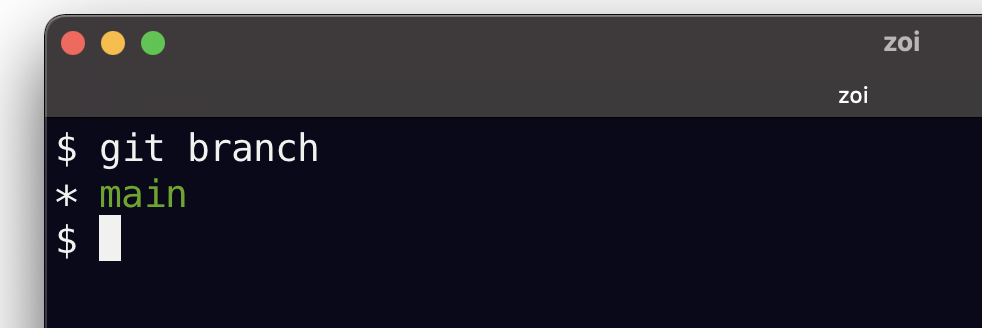

+++

On n'a qu'une branche, `main`, et en face de son nom **il y a une `*`** car c'est **la branche courante**.  Pour en créer une autre (qu'on va appeler `devel` car c'est une tradition fréquente)  on va utiliser une autre forme de `git branch`, on lui passe: 
* le nom de la branche
* et le commit où veut poser la branche.  
 (faites `git branch --help` pour voir les détails). 
 
Du coup pour créer la branche `devel` sur le parent de `HEAD` on peut écrire

```bash
$ git branch devel HEAD~
$ git branch
  devel
* main
```

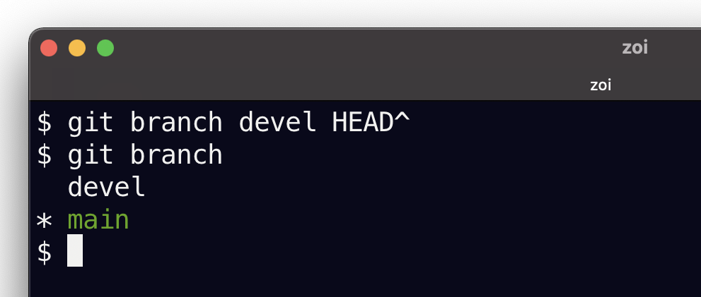

+++

qu'est-ce qui a changé ? pas grand-chose à ce stade, on remarque juste l'étiquette `devel` sur l'avant dernier commit:

```bash
$ git log --oneline --all
afec18a (HEAD -> main) une implémentation plus juste de la fonction factorielle
e2c02ca (devel) première implémentation de factorielle dans le fichier fact.py
31c4816 informations sur la licence
01b0604 licence+readme
```


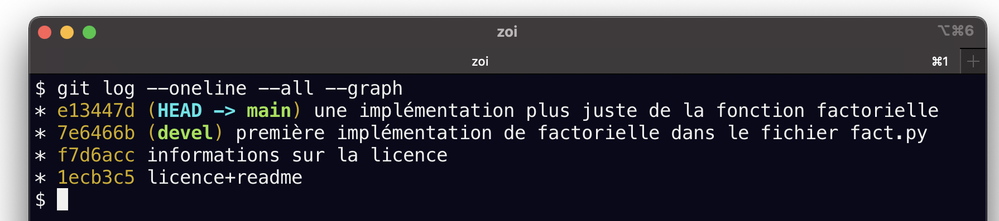

mais dans votre répertoire, le contenu de nos fichiers, dans notre espace de travail, est resté inchangé:
```bash
$ cat fact.py
def fact (n):
    if n == 1:
        return 1
    else:
        return n*fact(n-1)
```

+++

### *repository versus notre espace de travail*

+++

À ce stade, il est crucial de bien faire la différence entre:
* les **fichiers** présents dans le répertoire, qui appartiennent à ce qu'on a appelé l'*espace de travail*
* les **commits** qui appartiennent quant à eux au **repository**

+++

### changer de branche  (`git switch`)

+++

C'est maintenant que nous allons faire une commande qui a un effet plus intrusif.

Signalons bien que **la commande suivante devrait être exécutée seulement dans un repo propre**, c'est-à-dire sans modifications pendantes. Si ce n'est pas le cas, vous prenez le risque que git refuse de continuer.

+++

Nous voulons donc revenir en arrière (sur `devel`). On va demander à git de faire ça pour nous, on a préparé le terrain en créant une branche qui dit à partir d'où on veut recommencer, **il ne reste plus qu'à y aller**.

Mais attention, puisqu'on veut faire une modification à partir de l'avant dernier commit, ça veut dire qu'on veut travailler sur les fichiers de cet avant dernier commit. Donc **on veut aussi que git change nos fichiers**. C'est assez évident quand on y pense, mais parfois certains débutants sont surpris de réaliser que **git a touché à leurs fichiers**.

+++

Cela étant compris, nous pouvons y aller et taper ce qui suit

AVANT

```bash
$ git log --oneline --graph --all
* afec18a (HEAD -> main) une implémentation plus juste de la fonction factorielle
* e2c02ca (devel) première implémentation de factorielle dans le fichier fact.py
* 31c4816 informations sur la licence
* 01b0604 licence+readme
$ cat fact.py
def fact (n):
    if n == 1:
        return 1
    else:
        return n*fact(n-1)
    pass
```

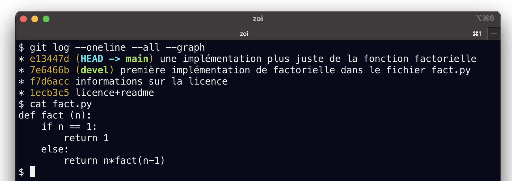


ON LE FAIT
```bash
$ git switch devel
Switched to branch 'devel'
```

APRÈS

```bash
$ cat fact.py
def fact (n):
    pass

$ git branch
* devel
  main

$ git log --oneline --graph --all
* afec18a (main) une implémentation plus juste de la fonction factorielle
* e2c02ca (HEAD -> devel) première implémentation de factorielle dans le fichier fact.py
* 31c4816 informations sur la licence
* 01b0604 licence+readme
```


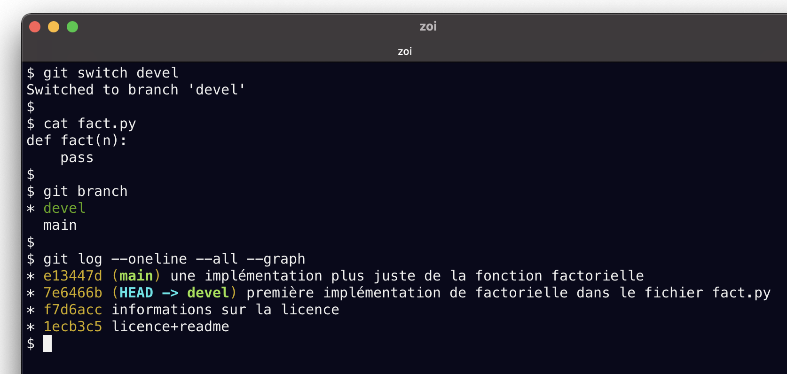

+++

Donc ce qu'il faut remarquer, c'est

* en premier que **nos fichiers ont changé** - ici `fact.py` est revenu en arrière
* en second, c'est **`devel` qui est désormais la branche courante**, comme le montrent `git branch` et `git log`
* la référence **`HEAD`** désigne maintenant notre **avant-dernier commit**
mais sinon bien entendu aucune branche n'a bougé

+++ {"tags": ["level_intermediate"]}

pour information, la séquence qui consiste à

* créer une nouvelle branche
* et l'adopter comme branche courante

est naturellement assez fréquente, et dans la pratique on utilise un raccourci qui est

```
git switch -c la-nouvelle-branche le-commit
```

qui fait d'un seul coup le `git branch` et le `git switch`

Dans notre cas nous aurions fait `git switch -c devel HEAD~`

+++

### committer sur la branche

+++

à ce stade, que va-t-il se passer d'après vous si on crée un commit ?
(je veux dire, on fait un changement dans un fichier, on l'ajoute dans l'index avec `add`, et on le committe avec `commit`)

En fait vous avez tous les éléments pour répondre:
* le commit va être créé avec comme parent le commit courant, donc le troisième
* la branche courante, à savoir `devel`, va monter d'un cran pour accompagner le commit nouvellement créé
* `HEAD` va faire de même comme d'habitude.

+++

on va le faire mais pour l'instant, on va choisir de faire une modification dans un autre fichier que `fact.py`, **pour éviter** ce qu'on appelle **un conflit**; on en reparlera le moment venu...

par exemple on va modifier la licence; pour ça, utilisez par exemple votre éditeur de code, pour mettre dans `licence.txt` le contenu suivant :

```
License Creative Commons CC-BY-NC-ND 4.0
https://creativecommons.org/licenses/by-nc-nd/4.0/
```

+++

À vous de jouer:

On vous laisse le soin de créer un commit comme on l'a appris jusqu'ici;
n'hésitez pas à utiliser `git status` et `git diff` au fur et à mesure en cas de besoin;
pour ma part j'ai mis `licence CC` comme message de commit, et voici ce que j'obtiens

```bash
$ git log --all --oneline --graph
* bda7835 (HEAD -> devel) licence CC
| * afec18a (main) une implémentation plus juste de la fonction factorielle
|/
* e2c02ca première implémentation de factorielle dans le fichier fact.py
* 31c4816 informations sur la licence
* 01b0604 licence+readme
```

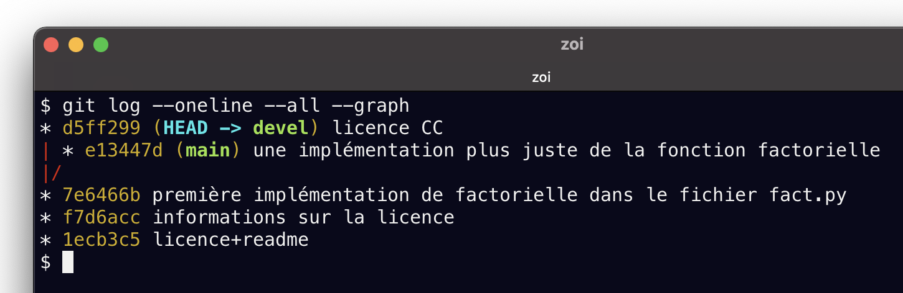

+++

**les choses à remarquer**

c'est ici que vous pouvez commencer à voir en pratique l'intérêt de la notion de branche courante

* notre graphe ne ressemble plus à un fil; c'était ce qu'on voulait faire, repartir d'une version antérieure
* on a réussi à créer une fourche dans le graphe, parce que le commit courant avait changé de place
* à part ça, toute la logique qu'on avait vue :
  * le commit est créé au dessus du commit courant
  * la branche courante suit le nouveau commit
  * les autres branches sont inertes  

  est toujours à l'oeuvre à l'identique

+++ {"tags": ["framed_cell"]}

exercice: on enleve le `--all` de la commande. Que remarquez vous ? 

d'après vous, pourquoi ça se comporte comme ça ?

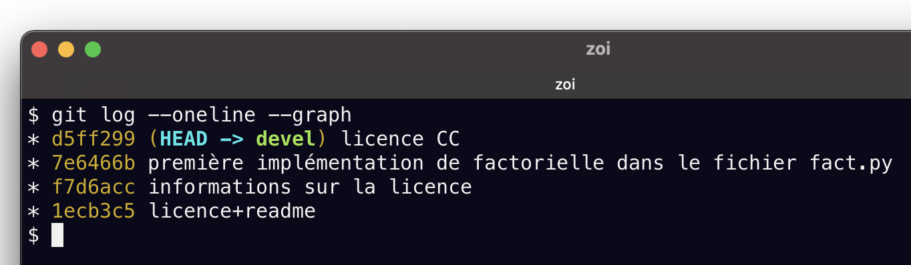

+++

## fusionner les deux branches

+++

nous allons pouvoir conclure ce scénario, avec la fusion des deux branches

ce qu'on cherche à faire, c'est de créer **un commit unique** qui **mélange les changements** qu'on a pu faire **sur les deux branches**

+++ {"tags": ["level_intermediate"]}

quelques précisions :

* ici pour la simplicité du scénario, chacun des deux chemins n'implique qu'un seul commit, mais ce n'est pas du tout une limitation
* les commits pourraient aussi bien concerner plein de fichiers, avec des renommages, des ajouts, des suppressions de fichier, la mécanique est la même
* la fusion entre les deux branches est **automatique**
* mais par contre, on voit bien que **si les deux branches modifient le même bout de code** mais de façon différente, la procédure automatisée de fusion va rencontrer un problème, car elle **ne va pas pouvoir décider** quelle est la "bonne" version à conserver
* dans ce cas on dit qu'**il y a un conflit** au moment de la fusion (merge)

nous ici on s'est arrangés (en modifiant des fichiers différents) pour que ça ne nous arrive pas; mais on en reparlera plus tard

+++

reprenons; nous sommes toujours sur la branche `devel`. Vérifions le avec `git status`:

```bash
$ git status
On branch devel
nothing to commit, working tree clean
```

+++

Si nous voulons fusionner `devel` avec `main`:   
nous allons utiliser la commande `git merge main`, mais avant de la taper, lisez pour bien comprendre ce que ca va faire:

* on **crée un nouveau commit**
* parce que le commit est produit par un `merge`, il va **avoir deux parents**  
  le premier est le commit courant `HEAD` (*aka* `devel`),   
  le second est (celui référencé par) `main`
* puisque `devel` est la branche courante, le nouveau commit sera désigné par `devel`
  et donc **`devel` va avancer d'un cran**
* et `main` qui n'est pas la branche courante reste sur place

Donc toujours avant de taper la commande, pouvez-vous imaginer à quoi va ressembler la sortie de `git log` après le merge ?

+++

une fois que vous avez bien réfléchi, voici la réponse :

```bash
# en fait puisque git merge produit un commit
# il faut lui passer un message

$ git merge main -m"mon premier merge"
Merge made by the 'recursive' strategy.
 fact.py | 5 ++++-
 1 file changed, 4 insertions(+), 1 deletion(-)

$ git log --all --oneline --graph
*   725be46 (HEAD -> devel) mon premier merge
|\
| * afec18a (main) une implémentation plus juste de la fonction factorielle
* | bda7835 licence CC
|/
* e2c02ca première implémentation de factorielle dans le fichier fact.py
* 31c4816 informations sur la licence
* 01b0604 licence+readme
```

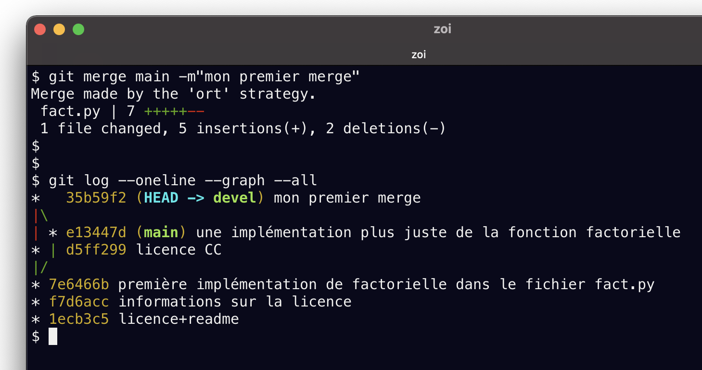

+++

Regardons la différence entre `devel` et `main`

```bash
git diff devel main
```

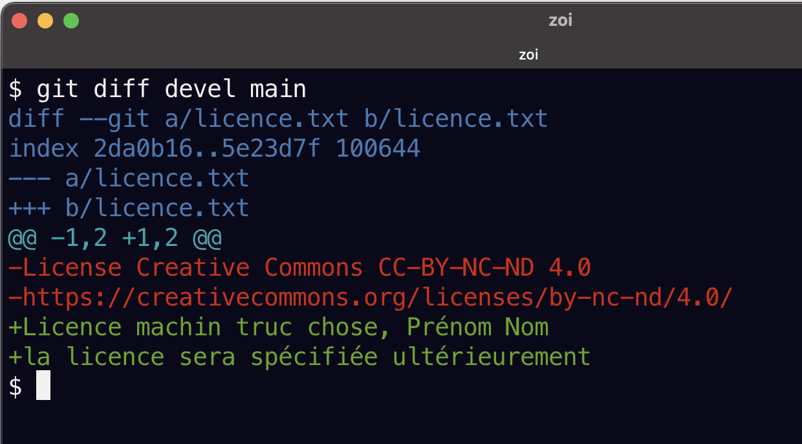

+++ {"tags": ["level_intermediate"]}

pour les curieux, je vous invite à vérifier que tout s'est bien passé; et pour ça on peut utiliser `git diff` à nouveau, mais entre plusieurs commits (faire `git diff --help` pour plus d'information)

on pourrait vérfier par exemple que
```
git diff HEAD^ HEAD
```
et
```
git diff HEAD~2 HEAD^2
```

donnent les mêmes résultats; pourquoi ?

+++ {"tags": ["level_advanced"]}

pour information, on peut même donner à `git merge` plusieurs commits; si on tape par exemple

```console
git merge commit1 commit2 commit3
```

on va créer un commit qui aura 4 parents, dans l'ordre le commit courant, puis `commit1`, `commit2` et `commit3`; une fusion de plus de deux branches d'appelle un *octopus-merge*

+++

## résumé

voir le notebook suivant, qui contient

* un bref récapitulatif des notions abordées
* un résumé des commandes qu'on a vues jusqu'ici

+++

Et pour conclure ...

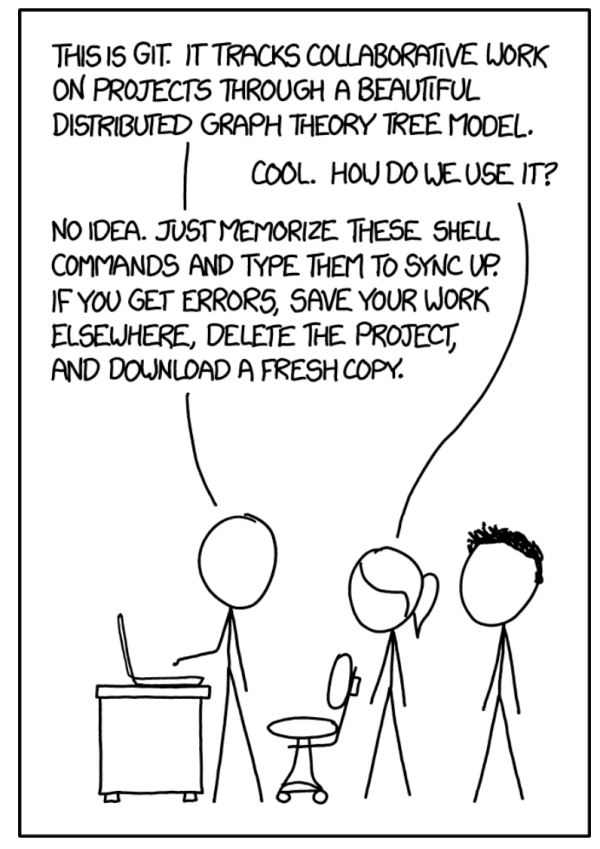
