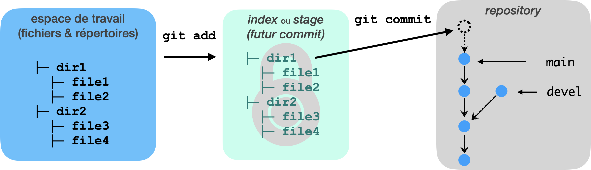

---
jupytext:
  cell_metadata_filter: all,-hidden,-heading_collapsed
  notebook_metadata_filter: all,-language_info,-toc,-jupytext.text_representation.jupytext_version,-jupytext.text_representation.format_version
  text_representation:
    extension: .md
    format_name: myst
kernelspec:
  display_name: Calysto Bash
  language: bash
  name: calysto_bash
nbhosting:
  title: "r\xE9sum\xE9 (1)"
---

Licence CC BY-NC-ND

    Thierry Parmentelat
    Valérie Roy

+++

# résumé du chapitre précédent

+++

## les commandes vues jusqu'ici

+++

| commande | action |
| ----------: | :-------- |
| `git version` | affiche la version de git |
| `git init` | crée un dépôt |
| ￮￮￮￮￮￮￮￮￮￮￮￮ | ***regarder*** |
| `git log` | liste les commits |
|         | `--all` pas seulement à partir du courant |
|         | `--oneline` plus compact |
|         | `--graph` montre la relation parent |
| `git status` | affiche l'état du dépôt: |
|            | branche courante |
|            | en vert: changements dans l'index |
|            | en rouge: changements pas dans l'index |
|            | fichiers pas dans le dépôt|
| `git diff` | entre les fichiers et l'index |
|          | `--cached` entre l'index et le commit |
| `git ls-files` | liste les fichiers dans le dépôt |
| ￮￮￮￮￮￮￮￮￮￮￮￮ | ***créer des commits*** |
| `git add` | verser un changement dans l'index |
| `git commit` | créer un commit |
| ￮￮￮￮￮￮￮￮￮￮￮￮ | ***les branches*** |
| `git branch` | liste les branches connues |
|  | `git branch newbranch <commit>` | 
|  | pour créer une nouvelle branche | 
| `git switch` | `git switch otherbranch` | 
|              | change de branche, l'index et les fichiers |
|              | sont mis en phase avec la nouvelle branche |
|              | `git switch -c newbranch <commit>` |
|              | crée une nouvelle branche et y va |
|              | raccourci pour `branch` + `switch` |
| `git merge`  | `git merge <commit>`  | 
| | fusionne le commit |

+++

## vocabulaire  : commit / branche / merge

* **commit** : pendant la réalisation, le·a développeu·r·se créera des *commits* afin de "figer" l'état son travail à un instant donné. Il sera alors possible de naviguer entre ces *commits*, afin de revoir l'historique de développement, rechercher la source d'un bug, restaurer la version exacte déployée à un client etc.

* **branche / *branch*** : une branche correpond juste à une étiquette vers un commit; la branche courante avance au fur et à mesure qu'on crée des commits;
notons que `git` permet de travailler sur plusieurs branches *en parallèle*: ainsi chaque développeur peut travailler sur sa propre version du code sans impacter les autres; la mise en commun se fera plus tard au moment de la *fusion* des branches.

* **fusion / *merge*** : typiquement on *fusionnera* la branche de travail d'un·e développeu·r·se sur la branche principale (`main`) afin d'y intégrer le résultat de son travail. Parfois l'outil n'y arrive pas tout seul (typiquement lorsque deux développeu·r·se·s ont modifié une même section de code) et on se trouve alors face à un **conflit** que l'on devra résoudre manuellement.

+++

## vocabulaire : dépôt / index / fichiers

* **dépôt** : l'espace dans lequel `git` range ses données; il contient principalement
  * les commits
  * les branches
* **l'index** : la zone tampon dont on se sert pour préparer le prochain commit
* **espace de travail**, ou encore plus simplement **fichiers** : au sens usuel, les dossiers et fichiers qu'on voit dans l'explorateur de fichiers et l'éditeur de code

+++

le flot de travail usuel est 

workflow: *espace de travail → index → dépôt*

mais **attention**, par exemple il arrive quand on revient en arrière ou qu'on fusionne, que les fichiers soient **modifiés par git**

workflow: **espace de travail ← index ← dépôt**

c'est pourquoi on recommande toujours d'exécuter ce type de commandes **dans un dépôt propre** (i.e. sans différence pendante)
