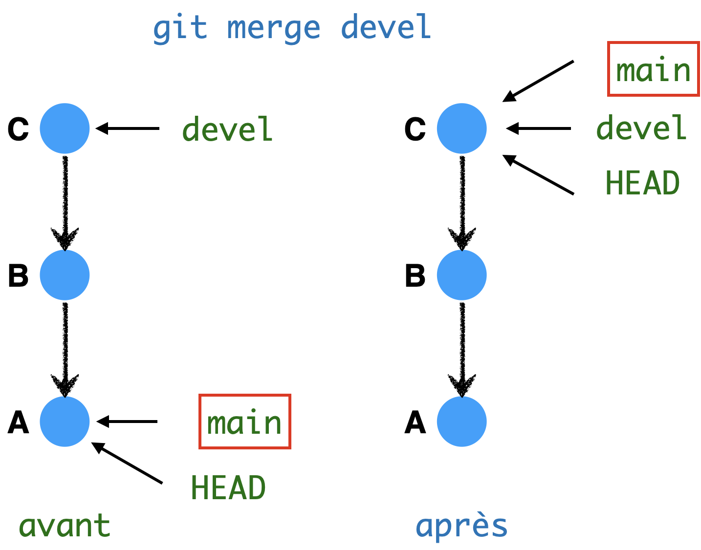
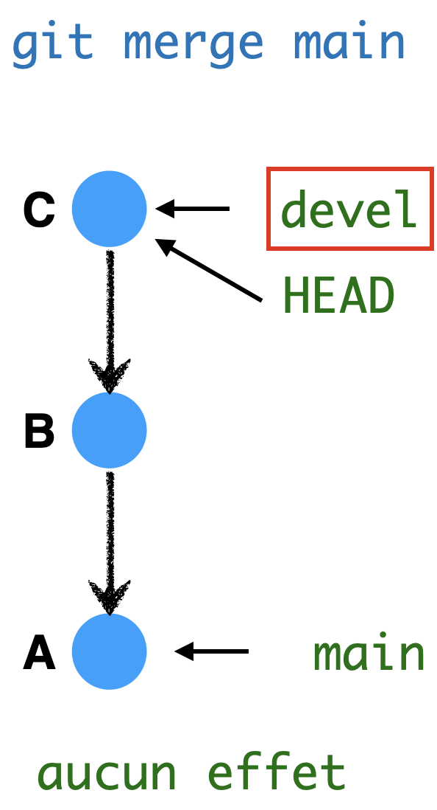
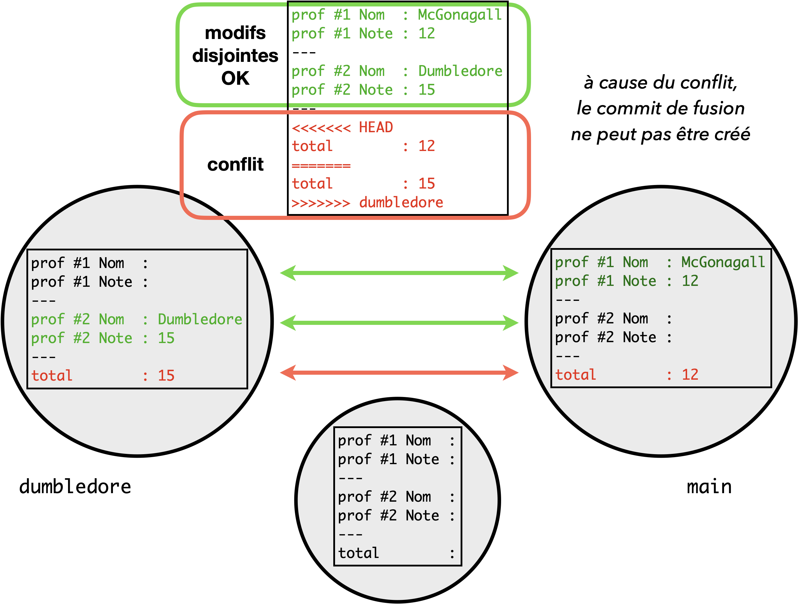
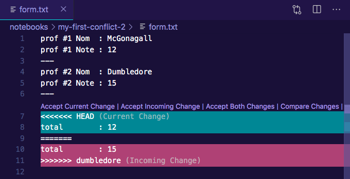
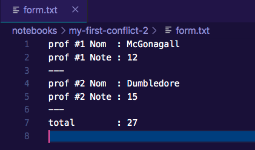

---
jupytext:
  cell_metadata_filter: all,-hidden,-heading_collapsed
  notebook_metadata_filter: all,-language_info,-toc,-jupytext.text_representation.jupytext_version,-jupytext.text_representation.format_version
  text_representation:
    extension: .md
    format_name: myst
kernelspec:
  display_name: Calysto Bash
  language: bash
  name: calysto_bash
nbhosting:
  title: la fusion
---

<div class="licence">
<span>Licence CC BY-NC-ND</span>
<div style="display:grid">
    <span>Thierry Parmentelat</span>
    <span>Valérie Roy</span>
</div>
</div>


+++

# la fusion, et les conflits

+++

## on contextualise

+++

on a vu tout à l'heure un exemple de fusion (*merge*) qui s'est passé sans douleur ni surprise - il faut dire qu'on avait tout bien choisi pour :)

mais toutes les fusions ne se comportent pas de la même manière, et dans ce notebook très court on va essayer de couvrir un peu tous les cas de figure :

* d'abord les cas simples, où il n'y a rien à faire (le *fast-forward*)
* et ensuite au contraire, le cas compliqué, la **fusion échoue** à cause d'un **conflit**

+++

### rappels

on rappelle que la forme générale de la fusion c'est 

    git merge <to-merge>
    
et que l'effet escompté, c'est qu'on se retrouve à la fin sur  
un commit qui **contienne à la fois le code courant et celui du commit `to-merge`**  

(que comme d'habitude on peut exprimer comme un nom de branche, un SHA1, le résultat d'une navigation avec les opérateurs `~` et `^`, etc…)

+++ {"tags": ["framed_cell"]}

on rappelle aussi d'ailleurs, dans un autre registre, qu'il est sage de lancer la commande `git merge` **dans un dépôt  propre**, sans modifications pendantes

+++

## le *fast-forward*

une fusion *fast-forward*, c'est le cas où **le commit courant est déjà un parent** (transitivement) de `to-merge`; comme par exemple ici :



* la branche courante est `main`, on fusionne avec le commit `devel`
* on cherche donc à créer un commit qui contienne à la fois de code de `main` et de `devel`
* mais, attendez : le commit `A` est un parent de `C`  
* et donc par définition `C` **vérifie déjà la bonne propriété** 
  * `C` contient main (qui est un de ses parents)
  * `C` contient `devel` (c'est `devel`)
  
et du coup dans ce cas de figure, la fusion **n'a même pas besoin de créer un commit**  
il suffit de **faire avancer** la branche courante (d'où le terme de *fast-forward*)

(bien sûr ça signifie aussi de modifier l'index et les fichiers;  
il faut toujours lancer la fusion sur un dépôt propre)

+++

### comment savoir si on est dans le cas du *fast-forward* ?

la règle qui permet de savoir si on est, ou pas, dans le cas d'un *fast-forward*, est simple :  
**si (et seulement si) il existe une chaine de parenté** entre les deux commits (celui ou on est, et celui qu'on veut fusionner),  
alors on est dans un *fast-forward*, il n'est pas besoin de créer un commit, il en existe déjà un qui matérialise la fusion

ici dans le premier exemple on avait `to-merge=C → B → HEAD=A`, donc pas besoin de créer un commit, simplement besoin d'avancer la branche courante

+++ {"tags": ["level_intermediate"]}

juste pour la curiosité, le cas se présente assez peu en pratique, mais que se passe-t-il d'après vous lorsque dans l'autre sens, on essaie de fusionner un parent ?



la réponse : rien du tout ! pourquoi ?

+++

## une "vraie fusion"

dans tous les autres cas  - c'est-à-dire quand il **n'existe pas de lien de parenté** entre les deux commits - on ne peut pas trouver un commit existant qui convienne, on doit donc **créer un nouveau commit**

pour réaliser ça, git a recours à des outils tiers (`diff` et `diff3`) qui reposent sur le fait que **les contenus sont textuels**

+++ {"tags": ["level_intermediate"]}

Le plus souvent, les projets qui utilisent `git` sont de nature très majoritairement textuelle (code, données, lois, etc..);

on y trouve fréquemment **aussi** des artefacts sous la forme de contenu binaire, comme du pdf, des images, du son, de la vidéo; pas de souci pour ajouter ce genre de contenus dans git, mais ses capacités pour fusionner de tels documents sont pauvres, voire nulles, sauf à paramétrer en profondeur un workflow *ad hoc*.

+++

Mais reprenons : la fusion fonctionne plutôt **très bien avec le texte**, tant que les deux modifications impactent des endroits différents dans les fichiers;

mais à l'impossible nul n'est tenu ! et si les deux **branches touchent le même endroit** du code, on atteint les limites de l'outil : **la fusion échoue avec un conflit**

+++

**en première lecture, on recommande de zapper la partie suivante**  
qui est taggée de niveau bleu intermédiaire, et de passer directement au résumé  
vous pourrez vous y reporter plus tard, lorsque vous aurez besoin de gérer un conflit…

+++ {"tags": ["level_intermediate"]}

## mon premier conflit

allons-y, on va provoquer cette situation en pratique :

* on va repartir d'un dépôt vierge, pour pouvoir expérimenter tranquillement, 
  et on va commencer par y créer un fichier unique
* on va créer deux branches distinctes qui touchent au même endroit du fichier
* du coup la fusion va échouer en signalant un conflit

+++ {"tags": ["level_intermediate"]}

### préparation

+++ {"tags": ["level_intermediate"]}

* je commence par créer un dépôt *ad hoc*; on a vu déjà toutes ces commandes :

```bash
mkdir my-first-conflict
cd my-first-conflict
git init
```

* je crée un fichier témoin, que j'appelle `form.txt`, avec ce contenu :

```console
prof #1 Nom  :
prof #1 Note :
---
prof #2 Nom  :
prof #2 Note :
---
total        :
```

* je crée un premier commit

```bash
git add form.txt
git commit -m"le formulaire vierge"
```

+++ {"tags": ["level_intermediate"]}

### les deux branches

+++ {"tags": ["level_intermediate"]}

ce qu'on veut faire, c'est simuler deux changements faits en même temps par deux personnes différentes; disons qu'on a deux profs, Minerva McGonagall et Albus Dumbledore, qui remplissent chacun leur partie

pour simplifier on va dire que 
* McGonagall utilise la branche `main`, et 
* Dumbledore utilise une branche `dumbledore`

Ils partent donc tous les deux du formulaire vide, ils remplissent chacun leur partie au mieux, et leurs versions respectives du fichier sont

```{code-cell}
:cell_style: split
:tags: [level_intermediate]

!cat form-mcgonagall.txt
```

```{code-cell}
:cell_style: split
:tags: [level_intermediate]

!cat form-dumbledore.txt
```

+++ {"tags": ["level_intermediate"]}

sauriez-vous simuler ce scénario ? 

pour McGonagall, c'est simple, comme on est sur main il suffit de modifier `form.txt` (1ère version, note 12) et de commiter

```bash
cp form-mcdonagall.txt
git add form.txt
git commit -m"notes mcgonagall"
```

+++ {"tags": ["level_intermediate"]}

pour la deuxième version, on a besoin de créer la branche `dumbledore` et de revenir en arrière; deux options, on peut

* soit décomposer : créer la branche puis y aller  
  ```bash
  git branch dumbledore HEAD~
  git switch dumbledore
  ```
* ou tout faire d'un coup avec le raccourci `git switch -c`  
   ```bash
   git switch -c dumbledore HEAD~
   ```

+++ {"tags": ["level_intermediate"]}

à ce stade, le formulaire est à nouveau vide (car on est revenu en arrière)

on remplit alors la fiche dans la version dumbledore, et on commite exactement comme au dessus; 


```bash
cp form-dumbledore.txt form.txt
git add form.txt
git commit -m"notes dumbledore"
```

+++ {"tags": ["level_intermediate"]}

et à ce stade le repo ressemble à ceci

```bash
$ git log --all --graph --oneline
* 34fa617 (HEAD -> dumbledore) notes dumbledore
| * 65b135a (main) notes mcgonagall
|/
* 6f201cc le formulaire vierge
```

+++ {"tags": ["level_intermediate"]}

### le merge

+++ {"tags": ["level_intermediate"]}

à ce stade on a le choix :

1. de se mettre sur `main` et de fusionner `dumbledore`
1. ou l'inverse, rester sur `dumbledore`, et fusionner `main`

c'est relativement équivalent, mais en général on préfère se mettre sur `main`, et c'est ce qu'on va faire ici

```bash
$ git switch main
Switched to branch 'main'
```

+++ {"tags": ["level_intermediate"]}

on peut maintenant essayer de fusionner
```bash
$ git merge dumbledore
Auto-merging form.txt
CONFLICT (content): Merge conflict in form.txt
Automatic merge failed; fix conflicts and then commit the result.
```

ouh là, il n'a pas l'air content !

+++ {"tags": ["level_intermediate"]}

ce qui se passe, c'est ceci



* les changements faits dans la zone "chacun chez soi" peut être fusionnés sans souci
* par contre comme les deux branches ont modifié la ligne de total chacune de leur côté  
  **la fusion ne sait pas quelle version retenir**

+++ {"tags": ["level_intermediate"]}

voilà, on a créé **un conflit**  
du coup **tout s'arrête**…  
dans quel état est notre dépôt à ce stade ?

* on n'a **pas créé** le commit de fusion, évidemment
* `git status` nous dit ceci
  ```console
  $ git status
  On branch main
  You have unmerged paths.
    (fix conflicts and run "git commit")
    (use "git merge --abort" to abort the merge)
  
  Unmerged paths:
    (use "git add <file>..." to mark resolution)
  	both modified:   form.txt

  no changes added to commit (use "git add" and/or "git commit -a")  
  ```
* on apprend comme ça que c'est dans `form.txt` que se situe le souci  
  (bon nous on n'a qu'un seul fichier, mais quand il y a 200 c'est une information intéressante)  
* et `git merge` nous a laissé les conflits **annotés directement dans le code**  
  avec cette forme qui est facile à voir visuellement
  ```console
  <<<<<<< HEAD
  total        : 12
  =======
  total        : 15
  >>>>>>> dumbledore
  ```  
* noter enfin qu'à ce stade, on ne **peut plus** utiliser la commande `git commit` pour créer un nouveau commit  
  il faut d'abord retourner dans un état propre: **nettoyer le repo**

+++ {"tags": ["level_intermediate"]}

### nettoyer (1): revenir en arriére

pour cela, on a principalement deux choix :

1. soit on décide que tout bien réfléchi, c'est beaucoup trop compliqué, on ne va pas s'en sortir, on veut juste tout défaire et revenir à l'état avant le `merge`, et pour ça on fait juste
  ```bash
  $ git merge --abort
  $ git status
  On branch main
  nothing to commit, working tree clean
  ```
  ouf, on a **tout effacé**, on est exactement **comme avant le merge**

+++ {"tags": ["level_intermediate"]}

### nettoyer (2): résoudre le conflit
2. soit on décide de gérer, c'est-à-dire de passer sur les conflits (nous on n'en a qu'un) et de décider quoi faire;

+++ {"tags": ["level_intermediate"]}

faisons-le; nous ici on veut dire que le total, ça n'est ni 12 ni 15, mais 27

pour résoudre le conflit, on doit utiliser un éditeur de code; dans vs-code par exemple on verrait ceci



la bonne nouvelle, c'est qu'il a détecté la présence d'un conflit; il nous propose même des options toutes faites (*Accept current change*…) pour choisir l'une ou l'autre des deux versions

la mauvaise nouvelle, c'est qu'aucune des deux ne convient, et ce qu'on va faire simplement c'est d'écrire la ligne comme elle doit être, et en enlevant toutes les annotations à base de `>>>` ou `<<<` ou `===`; ça donne ceci



+++ {"tags": ["level_intermediate"]}

à ce stade :

* comme `git status` nous indique toujours qu'on a un *Unmerged path*, on va indiquer à git que le conflit est résolu, en faisant
  ```bash
  git add form.txt
  ```
* et là on peut concrétiser le merge en faisant
  ```bash
  git merge --continue
  ```
  petit détail, on ne peut pas passer de message sur la ligne de commande avec -m ici  
  et remarquez qu'on aurait tout aussi bien pu faire tout simplement   
  ```bash
  git commit -m"fusion après conflit résolu à la main"
  ```
  
* et tout le monde est content
  ```console
  git log --oneline --graph
  *   4e94d65 (HEAD -> main) fusion après conflit résolu à la main
  |\
  | * 065c80e (dumbledore) notes dumbledore
  * | 975505c notes mcgonagall
  |/
  * 2230fb9 le formulaire vierge
  ```
  et
  ```console
  git status
  On branch main
  nothing to commit, working tree clean  git log --
  ```
  et
  ```
  cat form.txt
  prof #1 Nom  : McGonagall
  prof #1 Note : 12
  ---
  prof #2 Nom  : Dumbledore
  prof #2 Note : 15
  ---
  total        : 27
  ```

+++

## résumé

à retenir à propos de ce notebook :

* lorsque les **deux commits** à fusionner sont **parents** l'un de l'autre,  
   la fusion n'a **pas besoin de créer** un nouveau commit;   
   c'est ce qu'on appelle une fusion *fast-forward*


* dans le cas contraire, la **création** d'un commit est **nécessaire**
  * les **modifications disjointes** peuvent être fusionnées **automatiquement**
  * lorsque deux modifications changent la **même zone** de code par contre, la fusion atteint ses limites,  
  et on doit **résoudre les conflits**, puis finaliser la fusion à la main en appelant `git commit`
