---
jupytext:
  cell_metadata_filter: all,-hidden,-heading_collapsed
  notebook_metadata_filter: all,-language_info,-toc,-jupytext.text_representation.jupytext_version,-jupytext.text_representation.format_version
  text_representation:
    extension: .md
    format_name: myst
kernelspec:
  display_name: Calysto Bash
  language: bash
  name: calysto_bash
nbhosting:
  title: "diff\xE9rences pendantes"
---

Licence CC BY-NC-ND

    Thierry Parmentelat
    Valérie Roy

+++

# différences pendantes

+++

## on contextualise

nous avons vu précédemment qu'un dépôt git de travail se compose des trois morceaux : fichiers / index / commits  
on a vu qu'un dépôt *propre* est un dépôt dans lequel ces trois étages ont des contenus identiques  
et on a vu comment "faire avancer" une modification, en deux phases :

* d'abord on la met dans l'index avec `add`
* puis dans un commit avec `commit`

cela, ça couvre le cas idéal où on ne se trompe jamais, où on ne change pas d'avis  
mais dans la vraie vie bien sûr, ce n'est pas comme ça que ça fonctionne, et on a besoin de pouvoir rétropédaler

+++

dans ce notebook on résume les commandes utiles pour visualiser / gérer / abandonner les différences pendantes

par contre, on ne donne pas le mode d'emploi détaillé de toutes les commandes, à vous de chercher dans la documentation

s'agissant de la deuxième partie, inutile de retenir tous les détails, se souvenir que ça existe pour pouvoir y revenir en cas de besoin

+++

## le workflow usuel

dans un premier temps on revoit, sous une forme visuelle, les commandes qu'on a déjà pratiquées

+++

### un dépôt propre

on utilisera ce type de présentation dans la suite :

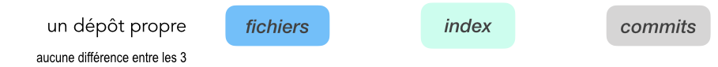

+++

### `git status` et `git diff` 

en général le dépôt n'est pas propre, on peut voir les (deux familles de) différences avec ces 2 commandes

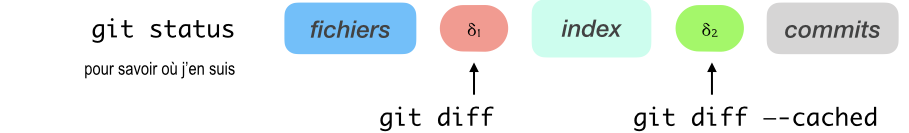

+++

### j'utilise mon éditeur

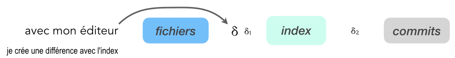

le changement que je sauve δ s'ajoute en fait aux différences existantes, qui s'accumulent évidemment.

+++

### `git add`

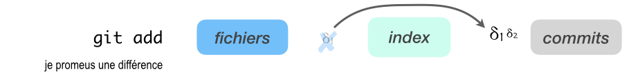

la différence apparait maintenant dans la deuxième zone (*staged changes*)

+++

### `git commit`

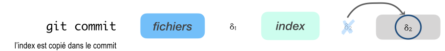

on crée le commit sur la base du contenu de l'index, du coup les deux (l'index et le dernier commit) sont maintenant égaux

+++ {"tags": ["level_intermediate"]}

## pour revenir en arrière

jusqu'à maintenant on a travaillé "de gauche à droite"

à présent on va voir des commandes nouvelles, qui permettent principalement de défaire la progression des changements", et donc d'aller "de droite à gauche""

**Attention** du coup car en faisant ça :

* d'une part cela peut causer des changements dans nos fichiers et/ou l'index
* au point que certaines d'entre elles **peuvent nous faire perdre du contenu**

à utiliser avec précaution donc; mais ça a une vraie utilité ! 

typiquement, on met en chantier une feature, et au bout d'une heure on se dit, non vraiment ça n'est pas du coup comme ça qu'il fallait prendre le problème

ou encore, pendant le debug on a ajouté 250 instructions `print()`, qu'on veut enlever; plutôt que de les enlever une par une, c'est plus malin de mettre les changements utiles dans l'index, et de jeter les autres différences

+++ {"tags": ["level_intermediate"]}

### `git reset`

pour annuler le `add` : si un changement a été promu dans l'index, on peut le déclasser

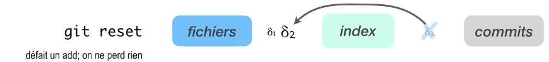

+++ {"tags": ["level_intermediate"]}

### `git checkout --`

pour jeter les changements non indexés

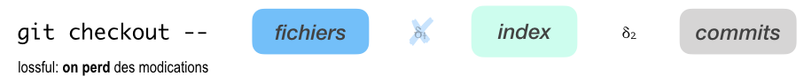

+++ {"tags": ["level_intermediate"]}

### `git reset --hard` 

pour se mettre inconditionnellement sur un commit, avec un dépôt propre

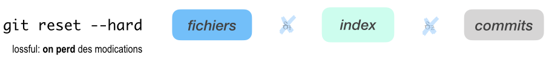

+++ {"tags": ["level_intermediate"]}

## refaire un commit avec `git commit --amend`

vous venez de faire un commit mais il est raté ! 

en général ça peut venir 

1. soit du texte du message qu'on a tapé trop vite
1. soit c'est plus profond, c'est le contenu
1. plus rarement c'est le nom de l'auteur qui est faux

dans tous les cas, pas de panique, `git commit --amend` est fait pour ça

le principe c'est de:
* refaire un commit qui a le·s même·s parent·s que le commit courant
* dans lequel on a **aussi** fait entrer l'index courant
* et en redemandant le message bien entendu

si bien que, selon le cas qui vous concerne dans les 2 ci-dessus, vous pouvez:

1. pour récrire votre message, refaites simplement  
   `git commit --amend`  
   juste après avoir fait le commit avec un message raté
   
1. si c'est plus profond, ajoutez dans l'index  
   les changements qui manquent au commit courant  
   avant de faire ici encore  
   `git commit --amend`  

1. dans le dernier cas, faites alors  
   `git commit --amend --author="Jean Dupont <jean.dupont@example.com>"`
  
remarquez qu'on ne modifie pas le commit courant (les commits sont immutables), on en crée simplement un nouveau (le premier reste dans le repo, mais s'il est inatteignable, il sera nettoyé au bout de quelque temps)

+++ {"tags": ["level_basic"]}

## utiliser une GUI

reprenons le niveau de base, pour signaler enfin qu'il existe plein d'outils graphiques pour simplifier l'utilisation de git, et notamment, surtout au début, pour avoir en permanence une représentation bien à jour de l'état du dépôt

on a déjà présenté l'extension git dans vs-code, qui a l'avantage d'être intégrée nativement, mais peut vite s'avérer limitée

voici rapidement quelques outils gratuits qui sont bien pratiques

+++

### Sourcetree

l'outil `Sourcetree` (malheureusement pas supporté sous linux) visualise les deux classes de différences comme ceci

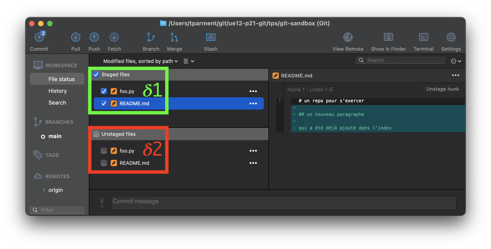

+++

voici une autre vue qui visualise aussi le graphe des commits

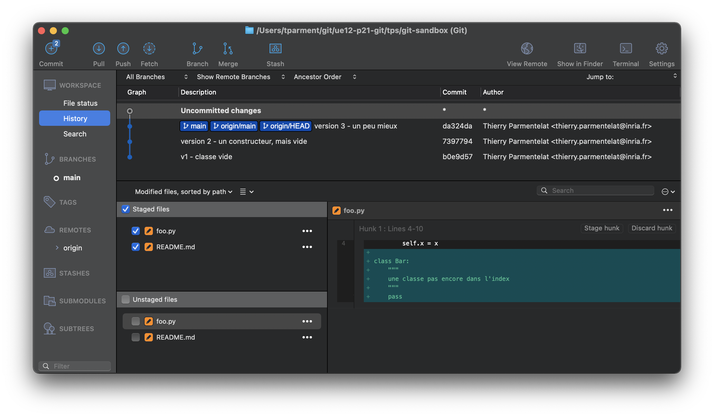

+++

### GitKraken

l'outil GitKraken, qui est disponible cette fois sur linux, les présente quant à lui comme ceci

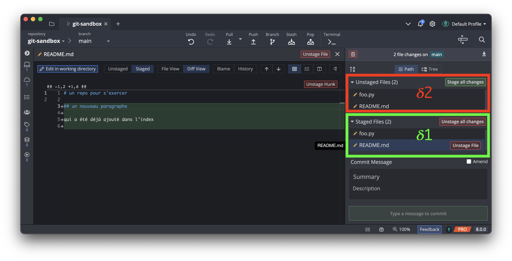

+++

ici encore l'outil sait afficher le graphe des commits

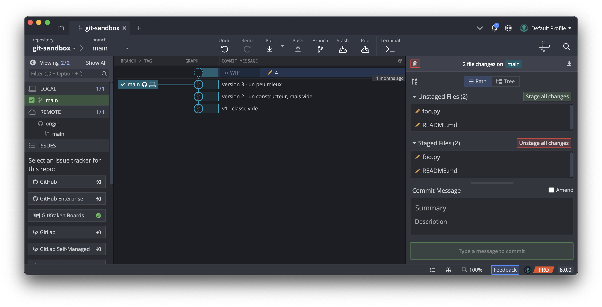

+++

### vs-code

vscode vient avec une extension native 'git'  
(rien à installer, simplement cliquer sur l'extension dans la barre de gauche)

voici comment on navigue dans les différences avec vs-code

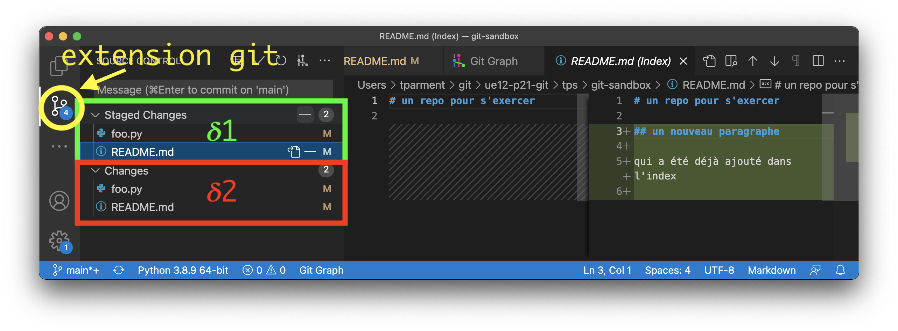

+++

si en plus vous installez l'extension 'git graph', vous pourrez aussi voir le graphe des commits directement dans vs-code

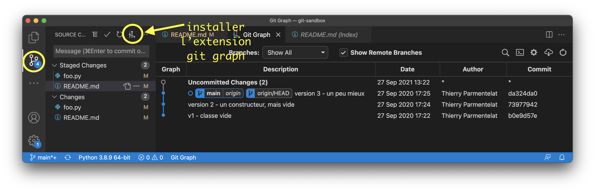
