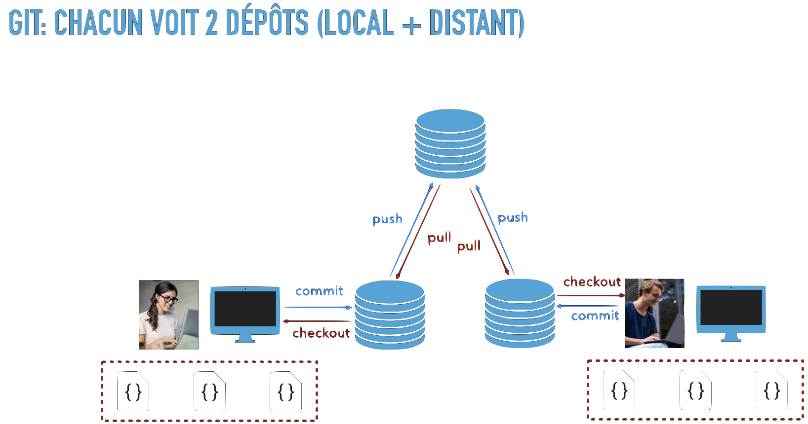

---
jupytext:
  cell_metadata_filter: all,-hidden,-heading_collapsed
  notebook_metadata_filter: all,-language_info,-toc,-jupytext.text_representation.jupytext_version,-jupytext.text_representation.format_version
  text_representation:
    extension: .md
    format_name: myst
kernelspec:
  display_name: Calysto Bash
  language: bash
  name: calysto_bash
nbhosting:
  title: "synchro entre d\xE9p\xF4ts : tirer"
---

<div class="licence">
<span>Licence CC BY-NC-ND</span>
<div style="display:grid">
    <span>Thierry Parmentelat</span>
    <span>Valérie Roy</span>
</div>
</div>


+++

# synchro entre dépôts : tirer

+++

## on contextualise

+++

### jusqu'ici on est resté local

jusqu'ici on a abordé `git` du point de vue "usage local"; on a créé tous nos commits et branches nous-mêmes, on n'a eu à aucun moment besoin du réseau.

Notez que même dans ce cadre délibérément limité, `git` remplit déjà plein de fonctions super utiles :

* les commits sont des sauvegardes, si on s'embrouille à un moment on peut facilement revenir à un état stable
* on a une trace structurée de tous les changements, par qui, quand, pourquoi
* on peut revenir en arrière
* on peut découper le travail en problèmes indépendants, en créant autant de **branches** que nécessaire
* on peut intégrer (**merge / fusionner**) facilement, une fois que tous les morceaux sont terminés

+++

### en réseau

mais bien sûr, on l'a vu dans les slides d'introduction, on peut aussi utiliser git pour travailler à plusieurs



pour ça, on va **utiliser le réseau pour synchroniser deux dépôts**

+++

### aller chercher

en réalité il y a très peu de commandes de git qui tombent dans la catégorie des synchros entre dépôts

nous allons les étudier pas à pas, et pour commencer **dans ce premier notebook** nous allons étudier les commandes qui **mettent à jour le dépôt local**, c'est-à-dire :

* `git clone` (pour initialiser à partir de, par exemple github)
* `git pull` (pour mettre à jour ultérieurement)

et du coup en passant on va parler aussi de `git fetch`, qui est si on veut un sous-produit de `git pull`

+++

## `git clone`

on a déjà parlé de cette commande, c'est celle qui permet en partant de rien, de dupliquer un dépôt, typiquement trouvé sur github; le fonctionnement est simple, et peut être illustré comme ceci

<video width="800px" controls src="media/manim-Clone.mp4" type="video/mp4"></video>

* dans un premier temps on duplique le graphe des commits, y compris le commit courant
* à partir de quoi on peut remplir l'index et les fichiers

+++

nous allons l'exécuter sur un repo de test pour mettre en évidence d'autres effets de la commande  
vérifiez que vous n'avez pas de dossier qui s'appelle `sandbox`, et tapez la commande

```bash
$ git clone https://github.com/ue12-p21/git-sandbox sandbox
Cloning into 'sandbox'...
remote: Enumerating objects: 4, done.
remote: Counting objects: 100% (4/4), done.
remote: Compressing objects: 100% (4/4), done.
remote: Total 4 (delta 0), reused 4 (delta 0), pack-reused 0
Receiving objects: 100% (4/4), done.
```

cela a eu pour effet de créer un dossier `sandbox` (le dernier paramètre passé à `git clone`); allons-y

```bash
cd sandbox
```

+++

## les *remotes*

tapons maintenant la commande 

```bash
$ git remote
origin
```

interprétons cette réponse sybilline :

* `git` nous dit que notre dépôt a un copain  
* dans le sens où : on a connaissance d'un **autre dépôt**, qui contient le **même projet**  
* dans le jargon `git`, un tel dépôt s'appelle un *remote*  
* et par commodité, `git clone` crée un *remote* pour se souvenir d'où on a fait le clône  
  car il y a toutes les chances qu'on ait de nouveau à échanger avec lui  
  et lui donne par convention le nom de **`origin`**

dans notre cas, ce dépôt, c'est bien sûr celui sur github - ça pourrait être quoi d'autre ?

+++ {"tags": ["level_intermediate"]}

d'ailleurs pour vérifier on peut faire

```bash
$ git remote get-url origin
https://github.com/ue12-p21/git-sandbox
```

+++

## `git pull`

à quoi ça sert un remote ?

une fois qu'on a cloné, on est redevenu totalement autonome; on pourrait par exemple couper le réseau, on a tout ce qu'il faut localement pour modifier le code, on peut travailler dans son coin, et créer localement des commits si on en a besoin

ça n'empêche pas que de temps en temps on a envie d'aller voir s'il n'y a pas eu des nouveautés; pour ça on va retourner demander au dépôt initial s'il y a du nouveau

pour ça la deuxième commande de synchronisation qu'on est amené à utiliser lorsqu'on a cloné un dépôt, c'est `git pull`

on regarde son fonctionnement illustré dans une vidéo (dans le prolongement du clip précédent)

<video width="800px" controls src="media/manim-Pull.mp4" type="video/mp4"></video>

pour résumer, on peut dire que <span style="border: 1px solid blue; padding: 5px; border-radius:5px"><code>git pull</code> = <code>git fetch</code> + <code>git merge</code></span>

+++

### `git pull` est intrusif

le premier point important à retenir, c'est que

* `git fetch` est une opération **totalement inoffensive**  
  en ce sens qu'elle n'a **pas d'impact** sur l'état de notre dépôt  
  (commit courant + index + fichiers)
* **dans un `pull` par contre**, c'est la partie `merge` - qu'on a déjà étudiée  
  qui elle, peut **avoir un impact sur l'état du dépôt** (commit courant + index + fichiers)
  
donc déja, comme premier conseil, il est bon de prendre l'habitude faire `git pull` **dans un dépôt propre**

+++

### branches distantes

le second point à retenir, c'est le rôle des références de branches distantes, comme par exemple

`origin/main`

on a vu dans la vidéo que `origin/main`:
* ça correspond à une étiquette **locale** (dans le repo local)
* qui nous permet de savoir où se trouve la branche `main` dans le dépôt **distant** (le remote) `origin`

+++

il faut insister sur le fait que c'est une **information locale** et que c'est du *best effort*; on ne **garantit pas** que cette information est **toujours à jour**, car elle est uniquement mise à jour par `git fetch`

dit autrement, si vous ne faites jamais ni `git pull` ni `git fetch` pendant un mois, vous aurez toujours `origin/main` qui pointe dans votre dépôt au même endroit, alors que sur github la branche aura sans doute avancé...

+++ {"tags": ["level_intermediate"]}

**Note** 
en pratique on fait plus souvent `git pull` que `git fetch`, car bien sûr souvent ce qu'on veut faire c'est se mettre à jour; et mon opinion c'est que c'est un peu dommage, car le fait de faire d'abord `fetch` permet de bien évaluer l'impact que va avoir le `pull` (notamment : est-ce un fast-forward ?)

une fois qu'on a dit ça, si vous utilisez une GUI comme `Sourcetree` ou `GitKraken` ou autre, il y a de fortes chances qu'elle fasse pour vous un `git fetch` **automatiquement** - genre toutes les 5 minutes; c'est très pratique car ça permet, justement, de recevoir des notifications lorsqu'il y a du nouveau dans le dépôt *upstream*

+++

### *fast-forward* ou pas ?

la troisième chose à retenir est que, puisque `pull` finit par faire un `merge`, tout ce qu'on a appris sur le merge s'applique ici aussi; et notamment :

* premier cas (comme dans la vidéo) si le commit qui vient de l'*upstream* est un enfant de mon commit  
 (donc en gros, si je n'ai **pas créé de commit de mon coté** depuis la dernière fois que j'étais à jour)  
  le merge va se faire en mode ***fast-forward***, on n'a pas besoin de créer un commit de fusion  
  je me retrouve sur **le même commit** que le remote 

* par contre, si entre temps j'avais fait un commit de mon côté, alors là le merge va **créer un commit de fusion**  
  ça va sans dire, mais forcément le commit de fusion est créé **dans mon dépôt** hein, forcément  
  on est en train de faire un `pull`, on n'est pas du tout en train d'essayer de toucher au dépôt distant  
  (dans lequel, de toutes façons, on n'a pas forcément le droit d'écrire en plus)

<video width="800px" controls src="media/manim-PullDiverge.mp4" type="video/mp4"></video>

+++ {"tags": ["level_intermediate"]}

### quelques détails

le plus souvent pour les débutants, il n'y a qu'un seul remote et il s'appelle `origin`  
sachez que dans des configurations plus complexes on doit bien entendu préciser avec quel remote on veut se synchroniser :

* `git fetch` est en réalité un raccourci pour `git fetch origin`
* `git pull` est en réalité un raccourci pour `git pull origin`  
  ou encore `git pull origin main` puisqu'on est sur la branche main

+++ {"tags": ["level_advanced"]}

pour les très avancés, signalons enfin la notion de *tracking branch*  
il y a quelque part dans la configuration du dépôt une information qui lie la branche locale `main` à la branche distante `main` du *remote* `origin`  
grâce à cela, on n'a pas besoin d'être plus explicite, et quand on tape juste `git pull` on merge `origin/main` dans `main`
