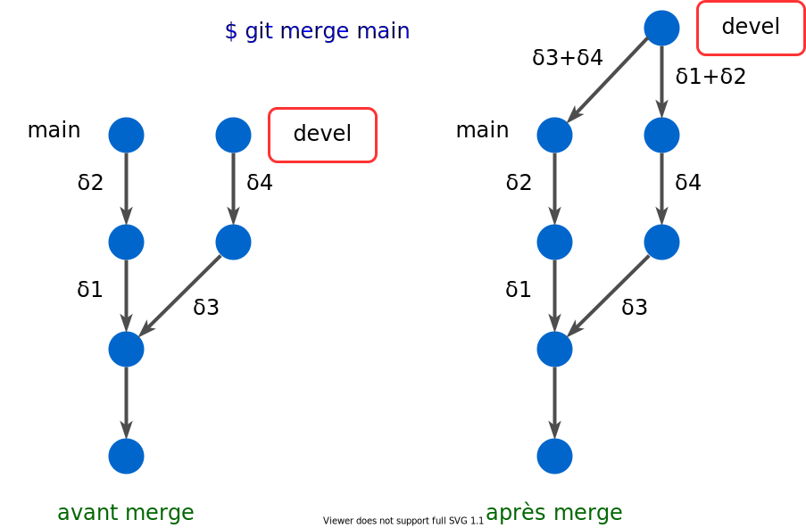
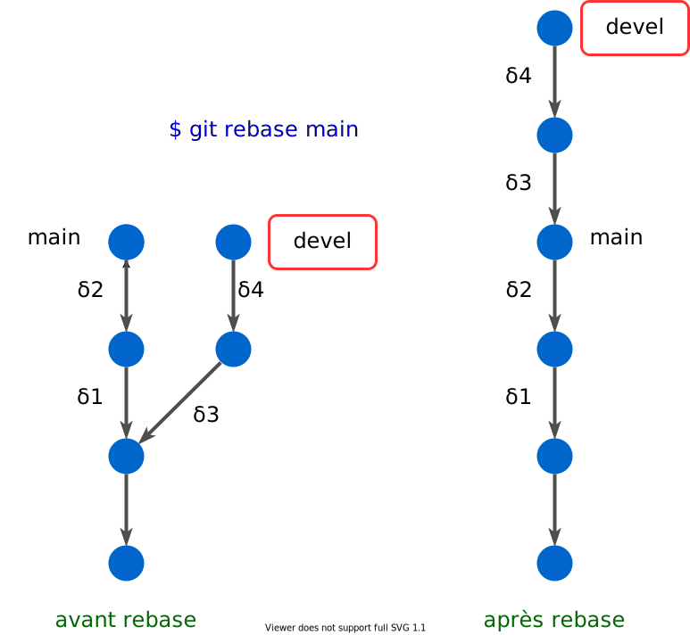

---
jupytext:
  cell_metadata_filter: all,-hidden,-heading_collapsed
  notebook_metadata_filter: all,-language_info,-toc,-jupytext.text_representation.jupytext_version,-jupytext.text_representation.format_version
  text_representation:
    extension: .md
    format_name: myst
kernelspec:
  display_name: Calysto Bash
  language: bash
  name: calysto_bash
nbhosting:
  title: rebase
---

Licence CC BY-NC-ND, Thierry Parmentelat & Valérie Roy

```{code-cell}
:trusted: true

%%python
from IPython.display import HTML
HTML(url="https://raw.githubusercontent.com/ue12-p22/intro/main/notebooks/_static/style.html")
```

# `rebase` (optionnel)

+++

## `rebase` en local

+++

revenons sur une opération utile **en local**

il s'agit de `rebase`, qui est en quelque sorte une alternative à `merge`, mais **pour fabriquer un historique plus linéaire**

voyons ça sur un exemple astrait; voici pour commencer le résultat d'un merge dans une situation typique; on n'est pas dans un *fast-forward*, le merge fabrique donc un commit de fusion, on a compris comment ça marche (on suppose ici qu'il n'y a pas de conflits naturellement)



+++

***

+++

voici ce que produirait un `git rebase` dans la même configuration



+++

c'est-à-dire qu'en quelque sorte on va

* chercher le commit commun le plus proche (à la fourche)
* prendre le petit bout de chemin qui nous a mené de cette fourche au commit courant
* et "rejouer" cette suite de commits, mais en partant de l'endroit qu'on a désigné dans la commande `rebase`, ici `main`

+++ {"trusted": true}

donc vous voyez que si on compare les deux scénarions (le merge et le rebase), il y a pas mal de similitudes en ceci que dans les deux cas, le contenu de `devel` est le même !  
en effet en partant de la fourche, on a bien dans les deux cas le résultat des changements $δ_1+δ_2+δ_3+δ_4$

ce qui change c'est l'absence de "diamant", on peut de cette façon garder un historique purement linéaire (certains projets imposent cette façon de fonctionner...)

+++

## `rebase` en mode distant

+++

du coup, si on revient sur notre approximation comme quoi

<span class=frame><code>git pull</code> = <code>git fetch</code> + <code>git merge</code></span>

eh bien on pourrait se dire, oui mais pourquoi pas alors avoir envie de faire plutôt un `rebase` plutôt qu'un `merge` ici ?

et en effet c'est possible, car
<span class=frame><code>git pull --rebase</code> = <code>git fetch</code> + <code>git rebase</code></span>

+++ {"tags": ["level_intermediate"]}

il y a même une variable de configuration pour cela, et c'est pour ça qu'on vous a peut-être fait faire à un moment

```bash
git config --global pull.rebase false
```

+++

## rebase en mode interactif

+++

enfin signalons que `rebase` peut être exécuté aussi en mode interactif, avec la commande

`git rebase -i`

grâce à cette commande, on peut assez facilement récrire l'historique (enfin le segment le plus récent), et ça permet notamment de
* changer l'ordre dans lequel sont faits les commits
* et du coup même jeter un commit complètement
* et aussi 'fusionner' deux commits pour n'en faire plus qu'un

+++

on ne donne pas plus de détails là-dessus, c'est une fonction assez avancée (mais qui devient vite indispensable lorsqu'on a compris comment elle marche)

on pourra faire une rapide démo en cours en créant
* un dépot avec un commit (un README)
* un premier commit avec le début d'une fonction python dans un `fact.py`
* un second commit avec un fichier de licence
* un troisième commit avec la fin de l'implémentation de la fonction python

et ensuite utiliser `git rebase -i` pour récrire cet historique avec seulement 3 commits
* le même point de départ
* un commit avec toute la fonction python
* un commit avec la licence

pour illustrer le changement d'ordre et la fusion
