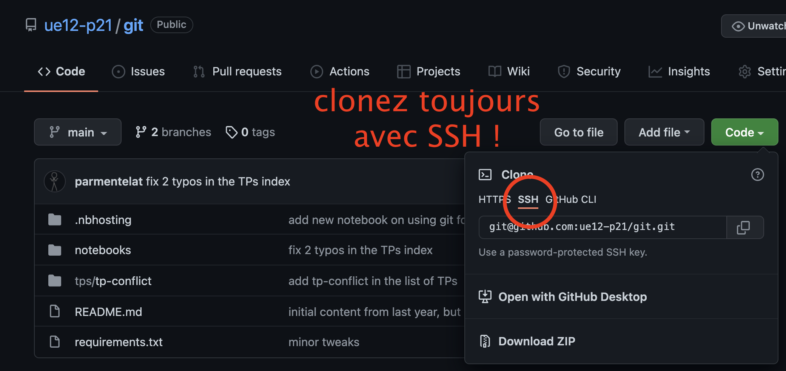

---
jupytext:
  cell_metadata_filter: all,-hidden,-heading_collapsed
  formats: md:myst
  notebook_metadata_filter: all,-language_info,-toc,-jupytext.text_representation.jupytext_version,-jupytext.text_representation.format_version
  text_representation:
    extension: .md
    format_name: myst
kernelspec:
  display_name: Calysto Bash
  language: bash
  name: calysto_bash
nbhosting:
  title: git pour les cours
---

<div class="licence">
<span>Licence CC BY-NC-ND</span>
<span>Thierry Parmentelat</span>
</div>


+++

# utiliser `git` pour les cours

+++

au début de l'année, il est pratique de pouvoir suivre les cours sur `nbhosting`

cependant nous vous recommandons, une fois que vous maitrisez mieux
l'environnement, de mettre **les notebooks et tout le contenu du cours sur votre
ordinateur**; pour cela la démarche à suivre est indiquée ci-dessous

pour rappel également, dans la vidéo suivante on a fait une micro-démo
de l'environnement en action
https://www.youtube.com/watch?v=vZUUQLlBPIs

attention, nous mettons régulièrement à jour les notebooks chaque semaine; du
coup pour garder votre travail **et** une version à jour, il faut pull le dépôt
distant; on explicite également les étapes de mise à jour ci-dessous

+++

## configurer `git`

+++

avant de commencer, assurez-vous que vous avez [bien configuré git comme
expliqué ici](0-00-setup.md)

+++

## au début du cours

### cloner les notebooks sur son ordinateur

* aller sur l'interface `Git Bash`
* se déplacer (avec les commandes `pwd` et `ls` et `cd`) dans le dossier souhaité
* une fois dans le dossier où vous souhaitez cloner les notebooks  
  (par exemple `/Users/jeanmineur/git/ue12-p21`), faire
  ```bash
  git clone https://github.com/ue12-p21/python-numerique.git
  ```
  pour trouver la bonne URL, regardez comment on fait dans la vidéo  
  en faisant bien attention de choisir le mode `SSH` comme ceci:  
  
* un dossier va être créé, ici il s'appelle `python-numerique`  
  (si vous préférez un autre nom, ajoutez le à la commande ci-dessus)
* dans le dossier choisi, vous allez trouver tout le contenu du cours, y compris
  les  notebooks ! ils sont généralement dans un sous-dossier `notebooks/`

en naviguant sur github et plus particulièrement sur la page de l'utilisateur
ue12-p21 (https://github.com/ue12-p21/), vous pouvez voir l'ensemble des
répertoires des cours d'informatique que vous avez eu jusque-là !

+++

### installer les dépendances

* *optionnel*: si vous utilisez un système d'environnements virtuels, prenez
  soin de sélectionner le bon, par exemple (selon votre setup)
  ```bash
  conda activate pynum
  ```
* *optionnel*: vous pouvez aussi créer un environnement virtuel en lui donnant
  un nom (et éventuellement la version de `python` que vous voulez), n'oubliez
  pas de le sélectionner (l'activer)
  ```bash
  conda create -n mon-env-pynum python=3.9.0
  conda activate mon-env-pynum
  ```

* dans le dossier du cours se trouve un fichier `requirements.txt`  
  allez dans ce dossier et tapez  
  ```bash
  pip install -r requirements.txt
  ```
* a minima il vous faut avoir installé `jupyter` et `jupytext`  
  qui devraient en principe être installés à ce stade; si ce n'est pas le cas,
  faites
  ```bash
  pip install jupyter jupytext
  ```

+++

## lire le cours

* toujours dans le dossier du cours, en faisant
  ```bash
  jupyter notebook
  ```
  vous lancez le serveur et ainsi pouvez lire les notebooks

+++

## mettre à jour sa version locale

avant chaque nouveau cours, pour mettre à jour votre dossier de cours:

* lancer `Git Bash`
* vous rendre dans le dossier local où vous avez cloné le répertoire  
  (la commande `git status` devrait fonctionner à cet endroit)
* faire `git pull`
* il est possible que tout fonctionne bien :)
* néanmoins, si jamais **vous avez modifié certains fichiers**, il vous faudra
  d'abord enregistrer vos modifications:
  ```bash
  git add -u
  git commit -m "j'enregistre mes modifications"
  ```

  (le `-u` signifie "*ajouter seulement les fichiers que j'ai modifiés*")
* après cela, refaites `git pull`

+++

###  en cas de conflit

si au moment du pull, vous voyez ce message:  
>  `automatic merge failed; fix conflicts and then commit the result.`

cela signifie qu'**il y a des conflits** (par exemple, vous avez fait
*localement* dans un fichier des modifications **au même endroit** que des
changements sur le même fichier sur le dépot distant); normalement c'est assez
rare, mais si c'est le cas, il va vous falloir régler les conflits; voici
comment les résoudre:

* après le `git pull`, faites un `git status`  
* les fichiers en rouge dans la catégorie `unmerged paths` correspondent à ceux
  qui sont en conflit.
* ouvrez les fichiers correspondants sur vscode.
  * les blocs en conflits (potentiellement plusieurs par fichier) ressemblent à ça :
    ```text
    <<<<<<< HEAD
    votre code
    =======
    le code distant
    >>>>>>> origin/main
    ```
* vous devez alors choisir le code final que vous gardez (soit en ne laissant
  qu'un seul des deux blocs dans le fichier, soit en faisant un mixte des deux);
  débarrassez-vous aussi des lignes-balises en `<<<` et `===` et `>>>`
* une fois tous les conflits de tous les fichiers résolus, vous pouvez faire
`git add` des fichiers en question, et enfin
  ```bash
  git commit --no-edit
  ```
  Et normalement vous avez maintenant la version locale à jour !  
  (le `--no-edit` sert à ne pas passer dans l'éditeur, il n'est vraiment pas
  utile ici de mettre un message spécifique)


si vous avez des questions, n'hésitez pas à nous contacter (ou à chercher sur
internet en anglais).
